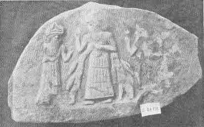
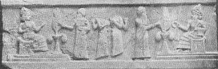

[Sacred-Texts](../../index) [Christianity](../index) [Index](index.md) [List
of Plates](bct01.htm#page_vii) [Previous Plate](bct_pl10.md) [Next
Plate](bct_pl12.md)

------------------------------------------------------------------------

PLATE XI

{facing [page 208](bct09.htm#page_208.md)}

A stele of the IIIrd Dynasty from the E-Gig-Par at
"Ur of the Chladees." (*See* [page 280](bct12.htm#pl11-1)..md)

 

The King Ur-Nammu making an offering to Nannar and
Nin-Gal. From the great stele of Ur-Nammu. (*See* [page
278](bct12.htm#pl11-2)..md)

------------------------------------------------------------------------

[Next Plate](bct_pl12.md)
