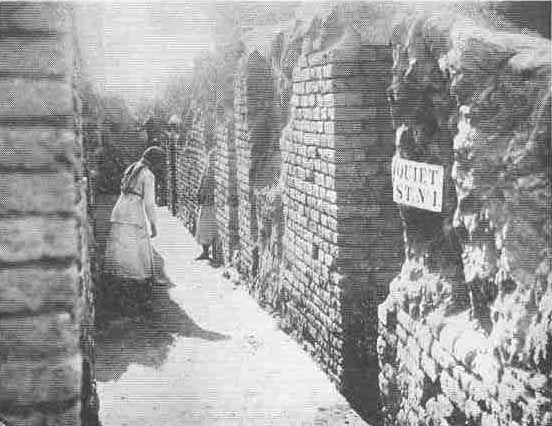

[Sacred-Texts](../../index) [Christianity](../index) [Index](index) [List
of Plates](bct01.htm#page_vii) [Previous Plate](bct_pl11) [Next
Plate](bct_pl13)

------------------------------------------------------------------------

PLATE XII

{facing [page 224](bct09.htm#page_224)}

A street of private houses recently excavated in the
city of "Ur of the Chaldees." The houses were built about 2100 B.C., *i.e.* about the time when Abraham and his
father Terah were living in Ur; this street must have been seen by these
patriarchs. They are the first private houses of the period to be
discovered, and their state of preservation is such that it is possible
to reconstruct the general plan of the house of a well-to-do citizen of
Ur. (*See* [page 284](bct12.htm#pl12).)

------------------------------------------------------------------------

[Next Plate](bct_pl13)
