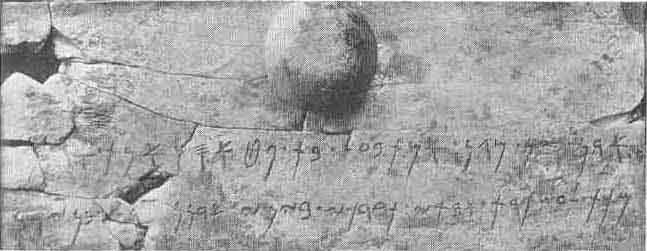
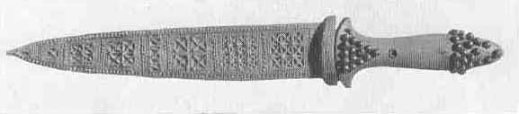

[Sacred-Texts](../../index) [Christianity](../index) [Index](index.md) [List
of Plates](bct01.htm#page_vii) [Previous Plate](bct_pl13.md) [Next
Plate](bct_pl15.md)

------------------------------------------------------------------------

PLATE XIV

{facing [page 256](bct11.htm#page_256.md)}

The cover of an ivory toilet box with a Phoenician
inscription. The box was probably sent from Syria to "Ur of the
Chaldees" about 600 B.C. (*See* [page
285](bct12.htm#pl14-1)..md)

Gold dagger, with a handle of deep blue lapis lazuli
studded with gold; the sheath in which it was found is also of gold.
(*See* [page 289](bct12.htm#pl14-2)..md)

------------------------------------------------------------------------

[Next Plate](bct_pl15.md)
