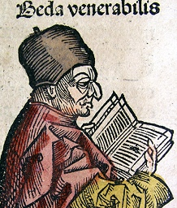

  
[Intangible Textual Heritage](../../index)  [Christianity](../index.md) 
[England](../../neu/eng/index.md) 

------------------------------------------------------------------------

[Buy this Book at
Amazon.com](https://www.amazon.com/exec/obidos/ASIN/014044565X/internetsacredte.md)

------------------------------------------------------------------------

<table width="75%">
<colgroup>
<col style="width: 50%" />
<col style="width: 50%" />
</colgroup>
<tbody>
<tr class="odd">
<td width="50%" data-valign="TOP"></td>
<td width="50%" data-valign="CENTER"><h1 id="bedes-ecclesiastical-history-of-england" data-align="CENTER">Bede's Ecclesiastical History of England</h1>
<h3 id="ed.-by-a.m.-sellar" data-align="CENTER">ed. by A.M. Sellar</h3>
<h4 id="section" data-align="CENTER">[1907]</h4></td>
</tr>
</tbody>
</table>

------------------------------------------------------------------------

[Contents](#contents)    [Start Reading](hist000.md)

------------------------------------------------------------------------

|                                                                                                                           |
|---------------------------------------------------------------------------------------------------------------------------|
|  |

------------------------------------------------------------------------

 [Title Page](hist000.md)  
[Preface](hist001.md)  
[Introduction](hist002.md)  
[Life of Bede](hist003.md)  

### Book I

[I. Of the Situation of Britain and Ireland, and of their ancient
inhabitants](hist004.md)  
[II. How Caius Julius Caesar was the first Roman that came into Britain.
\[54 AD\]](hist005.md)  
[III. How Claudius, the second of the Romans who came into Britain,
brought the islands Orcades](hist006.md)  
[IV. How Lucius, king of Britain, writing to Pope Eleutherus, desired to
be made a Christian.](hist007.md)  
[V. How the Emperor Severus divided from the rest by a rampart that part
of Britain which had been recovered.](hist008.md)  
[VI. Of the reign of Diocletian, and how he persecuted the Christians.
\[286 AD\]](hist009.md)  
[VIII. How, when the persecution ceased, the Church in Britain enjoyed
peace till the time of the](hist010.md)  
[IX. How during the reign of Gratian, Maximus, being created Emperor in
Britain, returned into Gaul with a mighty army. \[377 AD\]](hist011.md)  
[X. How, in the reign of Arcadius, Pelagius, a Briton, insolently
impugned the Grace of God. \[395 AD\]](hist012.md)  
[XI. How during the reign of Honorius, Gratian and Constantine were
created tyrants in Britain; and soon after the former was slain in
Britain, and the latter in Gaul. \[407 A.D.\]](hist013.md)  
[XII. How the Britons, being ravaged by the Scots and Picts, sought
succour from the Romans,](hist014.md)  
[XIII. How in the reign of Theodosius the younger, in whose time
Palladius was sent to the Scots that believed in Christ, the Britons
begging assistance of Aetius, the consul, could not obtain it. \[446
A.D.\]](hist015.md)  
[XIV. How the Britons, compelled by the great famine, drove the
barbarians out of their territories](hist016.md)  
[XV. How the Angles, being invited into Britain, at first drove off the
enemy; but not long after, making a league with them, turned their
weapons against their allies.](hist017.md)  
[XVI. How the Britons obtained their first victory over the Angles,
under the command of](hist018.md)  
[XVII. How Germanus the Bishop, sailing into Britain with Lupus, first
quelled the tempest of the](hist019.md)  
[XVIII. How the same holy man gave sight to the blind daughter of a
tribune, and then coming to St. Alban, there received of his relics, and
left other relics of the blessed Apostles and other martyrs. \[429
A.D.\]](hist020.md)  
[XIX. How the same holy man, being detained there by sickness, by his
prayers quenched a fire \[429 A.D.\]](hist021.md)  
[XX. How the same Bishops brought help from Heaven to the Britons in a
battle, and then returned home.](hist022.md)  
[XXI. How, when the Pelagian heresy began to spring up afresh, Germanus,
returning to Britain](hist023.md)  
[XXII. How the Britons, being for a time at rest from foreign invasions,
wore themselves out by civil](hist024.md)  
[XXIII. How the holy Pope Gregory sent Augustine, with other monks, to
preach to the English](hist025.md)  
[XXIV. How he wrote to the bishop of Arles to entertain them. \[596
A.D.\]](hist026.md)  
[XXV. How Augustine, coming into Britain, first preached in the Isle of
Thanet to the King of Kent, and having obtained licence from him, went
into Kent, in order to preach therein. \[597 A. D.\]](hist027.md)  
[XXVI. How St. Augustine in Kent followed the doctrine and manner of
life of the primitive Church,](hist028.md)  
[XXVII. How St. Augustine, being made a bishop, sent to acquaint Pope
Gregory with what had](hist029.md)  
[XXVIII. How Pope Gregory wrote to the bishop of Aries to help Augustine
in the work of God. \[601 A.D.\]](hist030.md)  
[XXIX. How the same Pope sent to Augustine the Pall and a letter, along
with several ministers of the Word. \[601 A.D.\]](hist031.md)  
[XXX. A copy of the letter which Pope Gregory sent to the Abbot
Mellitus, then going into Britain. \[601 A.D.\]](hist032.md)  
[XXXI. How Pope Gregory, by letter, exhorted Augustine not to glory in
his miracles. \[601 A.D.\]](hist033.md)  
[XXXII. How Pope Gregory sent letters and gifts to King Ethelbert. \[601
A.D.\]](hist034.md)  
[XXXIII. How Augustine repaired the church of our Saviour, and built the
monastery of the blessed](hist035.md)  
[XXXIV. How Ethelfrid, king of the Northumbrians, having vanquished the
nations of the Scots,](hist036.md)  

### Book II

[I. Of the death of the blessed Pope Gregory. \[604 A.D.\]](hist037.md)  
[II. How Augustine admonished the bishops of the Britons on behalf of
Catholic peace, and to that end wrought a heavenly miracle in their
presence; and of the vengeance that pursued them for their contempt.
\[Circ. 603 A.D.\]](hist038.md)  
[III. How St. Augustine made Mellitus and Justus bishops; and of his
death. \[604 A.D.\]](hist039.md)  
[IV. How Laurentius and his bishops admonished the Scots to observe the
unity of the Holy Church, particularly in keeping of Easter, and how
Mellitus went to Rome.](hist040.md)  
[V. How, after the death of the kings Ethelbert and Sabert, their
successors restored idolatry; for which reason, both Mellitus and Justus
departed out of Britain. \[616 A.D.\]](hist041.md)  
[VI. How Laurentius, being reproved by the Apostle Peter, converted King
Eadbald to Christ; and how the king soon recalled Mellitus and Justus to
preach the Word. \[617-618A.D.\]](hist042.md)  
[VII. How Bishop Mellitus by prayer quenched afire in his city. \[619
AD.\]](hist043.md)  
[VIII. How Pope Boniface sent the Pall and a letter to Justus, successor
to Mellitus](hist044.md)  
[IX. Of the reign of King Edwin, and how Paulinus, coming to preach the
Gospel, first converted his daughter and others to the mysteries of the
faith of Christ. \[625-626 A.D.\]](hist045.md)  
[X. How Pope Boniface, by letter, exhorted the same king to embrace the
faith. \[Circ. 625 A.D.\]](hist046.md)  
[XI . How Pope Boniface advised the king's consort to use her best
endeavours for his salvation](hist047.md)  
[XII. How Edwin was persuaded to believe by a vision which he had once
seen when he was in exile. \[Circ. 616 A.D.\]](hist048.md)  
[XIII. Of the Council he held with his chief men concerning their
reception of the faith of Christ, and how the high priest profaned his
own altars. \[627 A.D.\]](hist049.md)  
[XIV. How King Edwin and his nation became Christians; and where
Paulinus baptized them](hist050.md)  
[XV. How the province of the East Angles received the faith of Christ.
\[627-628 A.D.\]](hist051.md)  
[XVI. How Paulinus preached in the province of Lindsey; and of thc
character of the reign of Edwin. \[Circ. 628 A.D.\]](hist052.md)  
[XVII. How Edwin received letters of exhortation from Pope Honorius, who
also sent the pall to Paulinus. \[634 A.D.\]](hist053.md)  
[XVIII. How Honorius, who succeeded Justus in the bishopric of
Canterbury, received the pall and letters from Pope Honorius. \[634
A.D.\]](hist054.md)  
[XIX. How the aforesaid Honorius first, and afterwards John, wrote
letters to the nation of the Scots, concerning the observance of Easter,
and the Pelagian heresy. \[640 A.D.\]](hist055.md)  
[XX. How Edwin being slain, Paulinus returned into Kent, and had the
bishopric of Rochester conferred upon him. \[633 A.D.\]](hist056.md)  

### Book III

[I. How King Edwin's next successors lost both the faith of their nation
and the kingdom; but the most Christian King Oswald retrieved both.
\[633 A.D.\]](hist057.md)  
[II. How, among innumerable other miracles of healing wrought by the
wood of the cross, which King Oswald, being ready to engage against the
barbarians, erected, a certain man had his injured arm healed. \[634
A.D.\]](hist058.md)  
[III. How the same King Oswald, asking a bishop of the Scottish nation,
had Aidan sent him, and granted him an episcopal see in the Isle of
Lindisfarne. \[635A.D.\]](hist059.md)  
[IV. When the nation of the Picts received the faith of Christ. \[565
A.D.\]](hist060.md)  
[V. Of the life of Bishop Aidan. \[635 A.D.\]](hist061.md)  
[VI. Of King Oswald's wonderful piety and religion. \[635-642
A.D.\]](hist062.md)  
[VII. How the West Saxons received the Word of God by the preaching of
Birinus; and of his successors, Agilbert and Leutherius. \[635-670 A.
D.\]](hist063.md)  
[VIII. How Earconbert, King of Kent, ordered the idols to be destroyed,
and of his daughter Earcongota, and his kinswoman Ethelberg, virgins
consecrated to God. \[640 A.D.\]](hist064.md)  
[IX. How miracles of healing have been frequently wrought in the place
where King Oswald was](hist065.md)  
[X. How the dust of that place prevailed against fire. \[After 642
A.D.\]](hist066.md)  
[XI. How a light from Heaven stood all night over his relics, and how
those possessed with devils were healed by them. \[679-697
A.D.\]](hist067.md)  
[XII. How a little boy was cured of a fever at his tomb.](hist068.md)  
[XIII. How a certain person in Ireland was restored, when at the point
of death, by his relics.](hist069.md)  
[XIV. How on the death of Paulinus, Ithamar was made Bishop of Rochester
in his stead; and of the](hist070.md)  
[XV. How Bishop Aidan foretold to certain seamen that a storm would
arise, and gave them some](hist071.md)  
[XVI. How the same Aidan, by his prayers, saved the royal city when it
was fired by the enemy. \[Before 651 A.D.\]](hist072.md)  
[XVII. How a prop of the church on which Bishop Aidan was leaning when
he died, could not be consumed when the rest of the Church was on fire;
and concerning his inward life. \[651 A. D.\]](hist073.md)  
[XVIII. Of the life and death of the religious King Sigbert \[Circ. 631
A.D.\]](hist074.md)  
[XIX. How Fursa built a monastery among the East Angles, and of his
visions and sanctity, to](hist075.md)  
[XX. How, when Honorius died, Deusdedit became Archbishop of Canterbury;
and of those who](hist076.md)  
[XXI. How the province of the Midland Angles became Christian under King
Peada. \[653 A.D.\]](hist077.md)  
[XXII. How under King Sigbert, through the preaching of Cedd, the East
Saxons again received the faith, which they had before cast off \[653
A.D.\]](hist078.md)  
[XXIII. How Bishop Cedd, having a place for building a monastery given
him by King Etheiwald, consecrated it to the Lord with prayer and
fasting; and concerning his death. \[659-664 A. D.\]](hist079.md)  
[XXIV. How when King Penda was slain, the province of the Mercians
received the faith of Christ,](hist080.md)  
[XXV. How the question arose about the due time of keeping Easter, with
those that came out of Scotland. \[664 A.D.\]](hist081.md)  
[XXVI. How Colman, being worsted, returned home, and Tuda succeeded him
in the bishopric, and](hist082.md)  
[XXVII. How Egbert, a holy man of the English nation, led a monastic
life in Ireland. \[664 A.D.\]](hist083.md)  
[XXVIII. How, when Tuda was dead, Wilfried was ordained \[664
A.D.\]](hist084.md)  
[XXIX. How the priest Wighard was sent from Britain to Rome, to be
ordained archbishop; of his death there, and of the letters of the
Apostolic Pope giving an account thereof. \[667 A.D.\]](hist085.md)  
[XXX. How the East Saxons, during a pestilence, returned to idolatry,
but were soon brought back from their error by the zeal of Bishop
Jaruman. \[665 A.D.\]](hist086.md)  

### Book IV

[I. How when Deusdedit died, Wigihard was sent to Rome to receive the
episcopate; but he dying](hist087.md)  
[II. How Theodore visited all places; how the Churches of the English
began to be instructed in the study of holy Scripture and in the
catholic truth \[669 A.D.\]](hist088.md)  
[III. How the above-mentioned Ceadda was made Bishop of the province of
Mercians. Of his life, death, and burial. \[669 A.D.\]](hist089.md)  
[IV. How Bishop Colman, having left Britain, built two monasteries in
the country of the Scots; the](hist090.md)  
[V. Of the death of the kings Oswy and Eghert, and of the synod held at
the place Herutford, in](hist091.md)  
[VI. How Wynfrid being deposed, Sexwulf received his bishopric, and
Earconwald was made](hist092.md)  
[VII. How it was indicated by a light from heaven where the bodies of
the nuns should be buried in](hist093.md)  
[VIII. How a little boy, dying in the same monastery, called upon a
virgin that was to follow him; and](hist094.md)  
[IX. Of the signs which were shown from Heaven when the mother of that
community departed this life. \[675 A.D.?\]](hist095.md)  
[X. How a blind woman, praying in the burial-place of that monastery,
was restored to her sight. \[675 A.D.?\]](hist096.md)  
[XI. How Sebbi, king of the same province, ended his life in a
monastery. \[694 A.D.\]](hist097.md)  
[XII. How Haedde succeeded Leutherius in the bishopric of the West
Saxons; how Cuichelm](hist098.md)  
[XIII. How Bishop Wilfrid converted the province of the South Saxons to
Christ. \[681 A.D.\]](hist099.md)  
[XIV. How a pestilence ceased through the intercession of King Oswald.
\[681-686 A.D.\]](hist100.md)  
[XV. How King Caedwalla, king of the Gewissae, having slain Ethelwalch,
wasted that Province](hist101.md)  
[XVI. How the Isle of Wight received Christian inhabitants, and two
royal youths of that island were](hist102.md)  
[XVII. Of the Synod held in the plain of Haethfelth, Archbishop Theodore
being president. \[680 A.D.\]](hist103.md)  
[XVIII. Of John, the precentor of the Apostolic see, who came into
Britain to teach. \[680 A. D.\]](hist104.md)  
[XIX. How Queen Ethelthryth always preserved her virginity, and her body
suffered no corruption](hist105.md)  
[XX. A Hymn concerning her.](hist106.md)  
[XXI. How Bishop Theodore made peace between the kings Egfrid and
Etheired. \[679 A. D.\]](hist107.md)  
[XXII. How a certain captive's chains fell off when Masses were sung for
Him. \[679 A. D.\]](hist108.md)  
[XXIII. Of the life and death of the Abbess Hilda. \[614-680
A.D.\]](hist109.md)  
[XXIV. That there was in her monastery a brother, on whom a gift of song
was bestowed by Heaven. \[680 A.D.\]](hist110.md)  
[XXV. Of the vision that appeared to a certain man of God before the
monastery of the city Coludi was burned down.](hist111.md)  
[XXVI. Of the death of the Kings Egfrid and Hiothere. \[684-685 A.
D.\]](hist112.md)  
[XXVII. How Cuthbert, a man of God, was made bishop; and how he lived
and taught whilst still in](hist113.md)  
[XXVIII. How the same St. Cuthbert, living the life of an Anchorite, by
his prayers obtained a spring](hist114.md)  
[XXIX. How this bishop foretold that his own death was at hand to the
anchorite Herebert. \[687 A.D.\]](hist115.md)  
[XXX. How his body was found altogether uncorrupted after it had been
buried eleven years, and](hist116.md)  
[XXXI. Of one that was cured of a palsy at his tomb.](hist117.md)  
[XXXII. Of one who was lately cured of a disease in his eye at the
relics of St. Cuthbert.](hist118.md)  

### Book V

[I. How Ethelwald, successor to Cuthbert, leading a hermit's life,
calmed a tempest by his prayers](hist119.md)  
[II. How Bishop John cured a dumb man by his blessing. \[687
A.D.\]](hist120.md)  
[III. How he healed a sick maiden by his prayers. \[705
A.D.\]](hist121.md)  
[IV. How he healed a thegn's wife that was sick, with holy
water.](hist122.md)  
[V. How he likewise recalled by his prayers a thegn's servant from
death.](hist123.md)  
[VII. How Caedwalla, king of the West Saxons, went to Rome to be
baptised; and his successor Ini,](hist124.md)  
[VIII. How, when Archbishop Theodore died, Bertwald succeeded him as
archbishop, and, among](hist125.md)  
[IX. How the holy man, Egbert, would have gone into Germany to preach,
but could not; and how](hist126.md)  
[X. How Wilbrord, preaching in Frisand, converted many to Christ; and
how his two companions,](hist127.md)  
[XI. How the venerable Suidbert in Britain, and Wilbrord at Rome, were
ordained bishops for](hist128.md)  
[XII. How one in the province of the Northumbrians, rose from the dead,
and related many things](hist129.md)  
[XIII. How another contrarywise before his death saw a book containing
his sins, which was](hist130.md)  
[XIV. How another in like manner, being at the point of death, saw the
place of punishment](hist131.md)  
[XV. How divers churches of the Scots, at the instance of Adamnan,
adopted the Catholic Easter;](hist132.md)  
[XVI. The account given in the aforesaid book of the place of our Lord's
Nativity, Passion, and](hist133.md)  
[XVII. What he likewise wrote of the place of our Lord's Ascension, and
the tombs of the](hist134.md)  
[XVIII. How the South Saxons received Eadbert and Eolla, and the West
Saxons, Daniel and](hist135.md)  
[XIX. How Coinred, king of the Mercians, and Offa, king of the East
Saxons, ended their days at](hist136.md)  
[XX. How Albinus succeeded to the godly Abbot Hadrian, and Acca to
Bishop Wilfrid. \[709 A.D.\]](hist137.md)  
[XXI. How the Abbot Ceolfrid sent master-builders to the King of the
Picts to build a church, and](hist138.md)  
[XXII. How the monks of Hii, and the monasteries subject to them, began
to celebrate the canonical](hist139.md)  
[XXIII. Of the present state of the English nation, or of all Britain.
\[725-731 A.D.\]](hist140.md)  
[XXIV. Chronological recapitulation of the whole work: also concerning
the author himself.](hist141.md)  
