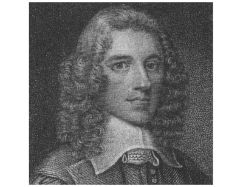

  
[Intangible Textual Heritage](../../index)  [Christianity](../index) 

------------------------------------------------------------------------

<table width="75%">
<colgroup>
<col style="width: 50%" />
<col style="width: 50%" />
</colgroup>
<tbody>
<tr class="odd">
<td width="50%" data-valign="TOP"></td>
<td width="50%" data-valign="CENTER"><h1 id="the-works-of-stephen-charnock" data-align="CENTER">The Works of Stephen Charnock</h1>
<h4 id="section" data-align="CENTER">[1629-1680]</h4></td>
</tr>
</tbody>
</table>

------------------------------------------------------------------------

[Contents](#contents)    [Start Reading](cha00)    [Text
\[Zipped\]](cha.txt.gz)

------------------------------------------------------------------------

Stephen Charnock (1628 - 1680), a Puritan divine, was an English Puritan
Presbyterian clergyman born in London.

Charnock studied at Emmanuel College, Cambridge, during which he was
converted to Christianity. After leaving the college, he was a private
teacher. He a minister of the faith in Southwark for a short time. He
continued on to New College, Oxford, where he earned a fellowship and
gained a position as senior proctor

He moved to Ireland in 1656 where he became a chaplain to Henry
Cromwell, governor of Ireland. In Dublin, he began preaching to a wide
audience. He preached to different classes and denominations with skill.

In 1660, the monarchy of England was restored after its brief time as
the Commonwealth of England. Charles II ascended the throne of England,
Scotland, and Ireland. Due to new restrictions, Charnock was now legally
prevented from practicing public ministry in Ireland and England.
Nevertheless he moved to England and continued to study and to minister
in non-public ways.

Charnock began a co-pastorship at Crosby Hall in London in 1675; this
was his last official place of ministry before his death in 1680.

Nearly all of the numerous writings attributed to him were transcribed
after his death. This is a collection of this longer works.

------------------------------------------------------------------------

 [Title Page](cha00)  
[Discourse of the Nature of Regeneneration](cha01)  
[Discourse of the Word, the Instrument of Regeneration](cha02)  
[Necessity of Regeneration](cha03)  
[Discourse on the Cleansing Virtue of Christ's Blood](cha04)  
[Discourse of the Efficient of Regeneration, Part I](cha05)  
[Discourse of the Efficient of Regeneration, Part II](cha06)  
[Discourse of God's being the Author of Reconciliation](cha07)  
