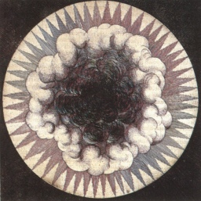

  
[Intangible Textual Heritage](../../index)  [Christianity](../index) 

------------------------------------------------------------------------

[Buy this Book at
Amazon.com](https://www.amazon.com/exec/obidos/ASIN/B00295S2X6/internetsacredte)

------------------------------------------------------------------------

<table width="75%">
<colgroup>
<col style="width: 50%" />
<col style="width: 50%" />
</colgroup>
<tbody>
<tr class="odd">
<td width="50%" data-valign="TOP"> 
from R. Fludd, Utriusque Cosmi, Vol. I [1617] (Public Domain Image)</td>
<td width="50%" data-valign="CENTER"><h1 id="the-cloud-of-unknowing" data-align="CENTER">The Cloud of Unknowing</h1>
<h2 id="ed.-by-evelyn-underhill" data-align="CENTER">ed. by Evelyn Underhill</h2>
<h4 id="section" data-align="CENTER">[1922]</h4></td>
</tr>
</tbody>
</table>

------------------------------------------------------------------------

[Contents](#contents)    [Start Reading](cou00)    [Page
Index](pageidx)    [Text \[Zipped\]](cou.txt.gz)

------------------------------------------------------------------------

|                                                                                                                           |
|---------------------------------------------------------------------------------------------------------------------------|
|  |

This is Evelyn Underhill's translation of the medieval spiritual
guidebook called The Cloud of Unknowing, written by an anonymous English
monk. At the core is a mystical approach to Christian prayer, in which
God is found not through rote knowledge, but through 'blind love.' It
has been described as Christianity with a Zen outlook. --J.B. Hare

------------------------------------------------------------------------

 [Title Page](cou00)  
[Introduction](cou01)  
[Glossary](cou02)  
[Prayer](cou03)  
[Prologue](cou04)  
[Table of the Chapters](cou05)  
[Chapter 1: Of four degrees of Christian men's living, and of the course
of his calling that this book was made unto](cou06)  
[Chapter 2: A short stirring to meekness, and to the work of this
book](cou07)  
[Chapter 3: How the work of this book shall be wrought and of the
worthiness of it before all other works](cou08)  
[Chapter 4: Of the shortness of this work, and how it may not be come to
by the curiosity of wit, nor by imagination](cou09)  
[Chapter 5: That in the time of this work all the creatures that ever
have been, be now, or ever shall be, and all the works of those same
creatures, should be hid under the cloud of forgetting](cou10)  
[Chapter 6: A short conceit of the work of this book, treated by
question](cou11)  
[Chapter 7: How a man shall have him in this work against all thoughts,
and specially against all those that arise of his own curiosity, of
cunning, and of natural wit](cou12)  
[Chapter 8: That in the time of his work all the creatures that ever
have been, be now, or ever shall be, and all the works of those
creatures, should be hid under the cloud of forgetting](cou13)  
[Chapter 9: That in the time of this work the rememberance of the
holiest creature that ever God made letteth more than it
profiteth](cou14)  
[Chapter 10: How a man shall know when his thought is no sin; and if it
be sin, when it is deadly and when it is venial.](cou15)  
[Chapter 11: That a man should weigh each thought and each stirring
after that it is, and always eschew recklessness in venial
sin.](cou16)  
[Chapter 12: That by Virtue of this word sin is not only destroyed, but
also virtues begotten.](cou17)  
[Chapter 13: What meekness is in itself, and when it is perfect and when
it is imperfect.](cou18)  
[Chapter 14: That without imperfect meekness coming before, it is
impossible for a sinner to come to the perfect Virtue of meekness in
this life](cou19)  
[Chapter 15: A short proof against their error that say, that there is
no perfecter cause to be meeked under, than is the knowledge of a man's
own wretchedness](cou20)  
[Chapter 16: That by virtue of this work a sinner truly turned and
called to contemplation cometh sooner to perfection than by any other
work; and by it soonest may get of God forgiveness of sins](cou21)  
[Chapter 17: That a very contemplative list not meddle him with active
life, nor of anything that is done or spoken about him, nor yet to
answer to his blamers in excusing of himself](cou22)  
[Chapter 18: How that yet unto this day all actives complain of
contemplatives as Martha did of Mary. Of the which complaining ignorance
is the cause](cou23)  
[Chapter 19: A short excusation of him that made this book, teaching how
all contemplatives should have all actives fully excused of their
complaining words and deeds](cou24)  
[Chapter 20: How Almighty God will goodly answer for all those that for
the excusing of themselves list not leave their business about the love
of Him](cou25)  
[Chapter 21: The true exposition of this gospel word, 'Mary hath chosen
the best part'](cou26)  
[Chapter 22: Of the wonderful love that Christ had to man in person of
all sinners truly turned and called to the grace of
contemplation](cou27)  
[Chapter 23: How God will answer and purvey for them in spirit, that for
business about His love list not answer nor purvey for
themselves](cou28)  
[Chapter 24: What charity is in itself, and how it is truly and
perfectly contained in the work of this book](cou29)  
[Chapter 25: That in the time of this work a perfect soul hath no
special beholding to any one man in this life](cou30)  
[Chapter 26: That without full special grace, or long use in common
grace, the work of this book is right travailous; and in this work,
which is the work of the soul helped by grace, and which is the work of
only God](cou31)  
[Chapter 27: Who should work in the gracious work of this book](cou32)  
[Chapter 28: That a man should not presume to work in this work before
the time that he be lawfully cleansed in conscience of all his special
deeds of sin](cou33)  
[Chapter 29: That a man should bidingly travail in this work, and suffer
the pain thereof, and judge no man](cou34)  
[Chapter 30: Who should blame and condemn other men's defaults](cou35)  
[Chapter 31: How a man should have him in beginning of this work against
all thoughts and stirrings of sin](cou36)  
[Chapter 32: Of two ghostly devices that be helpful to a ghostly
beginner in the work of this book](cou37)  
[Chapter 33: That in this work a soul is cleansed both of his special
sins and of the pain of them, and yet how there is no perfect rest in
this life](cou38)  
[Chapter 34: That God giveth this grace freely without any means, and
that it may not be come to with means](cou39)  
[Chapter 35: Of three means in the which a contemplative prentice should
be occupied; in reading, thinking, and praying](cou40)  
[Chapter 36: Of the meditations of them that continually travail in the
work of this book](cou41)  
[Chapter 37: Of the special prayers of them that be continual workers in
the work of this book](cou42)  
[Chapter 38: How and why that short prayer pierceth heaven](cou43)  
[Chapter 39: How a perfect worker shall pray, and what prayer is in
itself; and, if a man shall pray in words, which words accord them most
to the property of prayer](cou44)  
[Chapter 40: That in the time of this work a soul hath no special
beholding to any vice in itself nor to any virtue in itself](cou45)  
[Chapter 41: That in all other works beneath this, men should keep
discretion; but in this none](cou46)  
[Chapter 42: That by indiscretion in this, men shall keep discretion in
all other things; and surely else never](cou47)  
[Chapter 43: That all writing and feeling of a man's own being must
needs be lost if the perfection of this work shall verily be felt in any
soul in this life](cou48)  
[Chapter 44: How a soul shall dispose it on its own part, for to destroy
all witting and feeling of its own being](cou49)  
[Chapter 45: A good declaring of some certain deceits that may befall in
this work](cou50)  
[Chapter 46: A good teaching how a man shall flee these deceits, and
work more with a listiness of spirit than with any boisterousness of
body](cou51)  
[Chapter 47: A slight teaching of this work in purity of spirit;
declaring how that on one manner a soul should shew his desire unto God,
and on ye contrary, unto man](cou52)  
[Chapter 48: How God will be served both with body and with soul, and
reward men in both; and how men shall know when all those sounds and
sweetness that fall into the body in time of prayer be both good and
evil](cou53)  
[Chapter 49: The substance of all perfection is nought else but a good
will; and how that all sounds and comforts and sweetness that may befall
in this life be to it but as it were accidents](cou54)  
[Chapter 50: Which is chaste love; and how in some creatures such
sensible comforts be but seldom, and in some right oft](cou55)  
[Chapter 51: That men should have great wariness so that they understand
not bodily a thing that is meant ghostly; and specially it is good to be
wary in understanding of this word in, and of this word up](cou56)  
[Chapter 52: How these young presumptuous disciples misunderstand this
word in, and of the deceits that follow thereon](cou57)  
[Chapter 53: Of divers unseemly practices that follow them that lack the
work of this book](cou58)  
[Chapter 54: How that by virtue of this work a man is governed full
wisely, and made full seemly as well in body as in soul](cou59)  
[Chapter 55: How they be deceived that follow the fervour of spirit in
condemning of some without discretion](cou60)  
[Chapter 56: How they be deceived that follow the fervour of spirit in
condemning of some without discretion](cou61)  
[Chapter 57: How these young presumptuous disciples misunderstand this
other word up; and of the deceits that follow thereon](cou62)  
[Chapter 58: That a man shall not take ensample of Saint Martin and of
Saint Stephen, for to strain his imagination bodily upwards in the time
of his prayer](cou63)  
[Chapter 59: That a man shall not take ensample at the bodily ascension
of Christ, for to strain his imagination upwards bodily in the time of
prayer: and that time, place, and body, these three should be forgotten
in all ghostly working](cou64)  
[Chapter 60: That the high and the next way to heaven is run by desires,
and not by paces of feet](cou65)  
[Chapter 61: That all bodily thing is subject unto ghostly thing, and is
ruled thereafter by the course of nature, and not contrariwise](cou66)  
[Chapter 62: How a man may wit when his ghostly work is beneath him or
without him and when it is even with him or within him, and when it is
above him and under his God](cou67)  
[Chapter 63: Of the powers of a soul in general, and how Memory in
special is a principal power comprehending in it all the other powers
and all those things in the which they work](cou68)  
[Chapter 64: Of the other two principal powers, Reason and Will, and of
the work of them before sin and after](cou69)  
[Chapter 65: Of the first secondary power, Imagination by name; and of
the works and of the obedience of it unto Reason, before sin and
after](cou70)  
[Chapter 66: Of the other secondary power, Sensuality by name; and of
the works and of the obedience of it unto Will, before sin and
after](cou71)  
[Chapter 67: That whoso knoweth not the powers of a soul and the manner
of her working, may lightly be deceived in understanding of ghostly
words and of ghostly working; and how a soul is made a God in
grace](cou72)  
[Chapter 68: That nowhere bodily, is everywhere ghostly; and how our
outer man calleth the work of this book nought](cou73)  
[Chapter 69: How that a man's affection is marvelously changed in
ghostly feeling of this nought, when it is nowhere wrought](cou74)  
[Chapter 70: That right as by the defailing of our bodily wits we begin
more readily to come to knowing of ghostly things, so by the defailing
of our ghostly wits we begin most readily to come to the knowledge of
God, such as is possible by grace to be had here](cou75)  
[Chapter 71: That some may not come to feel the perfection of this work
but in time of ravishing, and some may have it when they will, in the
common state of man's soul](cou76)  
[Chapter 72: That a worker in this work should not deem nor think of
another worker as he feeleth in himself](cou77)  
[Chapter 73: How that after the likeness of Moses, of Bezaleel and of
Aaron meddling them about the Ark of the Testament, we profit on three
manners in this grace of contemplation, for this grace is figured in
that Ark](cou78)  
[Chapter 74: How that the matter of this book is never more read or
spoken, nor heard read or spoken, of a soul disposed thereto without
feeling of a very accordance to the effect of the same work: and of
rehearsing of the same charge that is written in the prologue](cou79)  
[Chapter 75: Of some certain tokens by the which a man may prove whether
he be called of God to work in this work](cou80)  
[Index of Pages of the Print Edition](cou81)  
