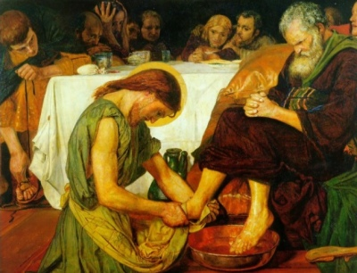

  
[Intangible Textual Heritage](../../index)  [Christianity](../index.md) 
[Apocrypha](../apo/index.md) 

------------------------------------------------------------------------

<table width="75%">
<colgroup>
<col style="width: 50%" />
<col style="width: 50%" />
</colgroup>
<tbody>
<tr class="odd">
<td width="50%" data-valign="TOP"></td>
<td width="50%" data-valign="CENTER"><h1 id="the-didache" data-align="CENTER">The Didache</h1>
<h2 id="by-charles-h.-hoole" data-align="CENTER">by Charles H. Hoole</h2>
<h4 id="section" data-align="CENTER">[1894]</h4></td>
</tr>
</tbody>
</table>

------------------------------------------------------------------------

[Contents](#contents)    [Start Reading](did00.md)    [Page
Index](pageidx)    [Text \[Zipped\]](did.txt.gz.md)

------------------------------------------------------------------------

This is a translation of an apocryphal text, the Didache, or the 'two
ways,' a set of ethical precepts attributed to the original apostles. In
the introduction, Hoole presents evidence that it was derived from other
apocryphal works, such as the Shepherd of Hermas, and the Epistle of
Barnabas. However, modern scholars are certain that the Didache dates to
the late first or early second century. It was considered canonical by
some of the Church Fathers. It was eventually rejected from the canon,
but is still considered part of the collection of Apostolic Fathers by
the Catholic Church. The text was lost, but was rediscovered in 1873 in
a Greek Codex written in 1075 and published along with other texts in
1883. As such it represents a window into a very early Christianity,
including information on rituals such as baptism, and the itinerant
ministry of the time.--J.B. Hare, Jan. 3, 2010.

------------------------------------------------------------------------

 [Title Page](did00.md)  
[Introduction](did01.md)  
[Introduction to Greek Text](did02.md)  
[The Didache: Translation](did03.md)  
[Notes](did04.md)  
