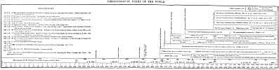

  
[Intangible Textual Heritage](../../index)  [Christianity](../index.md) 
[Index](index)  [Previous](esc21.md) 

------------------------------------------------------------------------

*Evidence from Scripture and History of the Second Coming of Christ*, by
William Miller, \[1842\], at Intangible Textual Heritage

------------------------------------------------------------------------

 

 

[  
Click to enlarge](img/chart.jpg.md)  
Chart of the Chronology of the World (260Kb)  

 

**SUPPLEMENT.**

** **

 

EXPOSITION OF MILLER'S CHART

 

OF THE

 

CHRONOLOGY OF THE WORLD, AND OF THE PROPHETIC PERIODS.

 

☞ See Chart, at the end of the book.

 

<table data-border="1">
<colgroup>
<col style="width: 20%" />
<col style="width: 20%" />
<col style="width: 20%" />
<col style="width: 20%" />
<col style="width: 20%" />
</colgroup>
<tbody>
<tr class="odd">
<td data-valign="top">
I.
</td>
<td data-valign="top">
THE SCALE of the Chart represents 6000 years from the creation.
</td>
<td data-valign="top">
Period
</td>
<td data-valign="top">
B.C.
</td>
<td data-valign="top">
A.D.
</td>
</tr>
<tr class="even">
<td data-valign="top">
 
</td>
<td data-valign="top">
 
</td>
<td data-valign="bottom">
6000
</td>
<td data-valign="bottom">
4157
</td>
<td data-valign="bottom">
1843
</td>
</tr>
<tr class="odd">
<td data-valign="top">
II.
</td>
<td data-valign="top">
The first space on the Chart represents the six millenniums, before the "Great Sabbath of rest." See "Miller's Views," page 157, Lecture on the Great Sabbath, where this subject is fully explained.
</td>
<td data-valign="top">
Periods between important events.
</td>
<td data-valign="top">
From the creation.
</td>
<td data-valign="top">
Before the birth of Christ.
</td>
</tr>
<tr class="even">
<td data-valign="top">
 
</td>
<td data-valign="top">
☞ This space is also divided into different parts, showing the chronology of the most important events in the history of the world and the church. <a href="#fn_2">*</a>
</td>
<td data-valign="bottom">
Periods.
</td>
<td data-valign="bottom">
A.M.
</td>
<td data-valign="bottom">
B.C.
</td>
</tr>
<tr class="odd">
<td data-valign="top">
1.
</td>
<td data-valign="top">
The flood, in the 600th year of Noah's age.
</td>
<td data-valign="bottom">
1656
</td>
<td data-valign="bottom">
1656
</td>
<td data-valign="bottom">
2501
</td>
</tr>
<tr class="even">
<td data-valign="top">
2.
</td>
<td data-valign="top">
From the flood to the Exode, 428 years.
</td>
<td data-valign="bottom">
428
</td>
<td data-valign="bottom">
2084
</td>
<td data-valign="bottom">
2073
</td>
</tr>
<tr class="odd">
<td data-valign="top">
3.
</td>
<td data-valign="top">
The Israelites enter Canaan--470 years from the Exode.
</td>
<td data-valign="bottom">
470
</td>
<td data-valign="bottom">
2554
</td>
<td data-valign="bottom">
1603
</td>
</tr>
<tr class="even">
<td data-valign="top">
4.
</td>
<td data-valign="top">
Administration of Joshua, and the Judges began, A.M. 2554, and continued 473 years--ending
</td>
<td data-valign="bottom">
473
</td>
<td data-valign="bottom">
3027
</td>
<td data-valign="bottom">
1130
</td>
</tr>
<tr class="odd">
<td data-valign="top">
5.
</td>
<td data-valign="top">
Beginning of the Temple by Solomon, being a period of 108 years from Samuel the prophet, or the end of the Judges.
</td>
<td data-valign="bottom">
108
</td>
<td data-valign="bottom">
3135
</td>
<td data-valign="bottom">
1022
</td>
</tr>
<tr class="even">
<td data-valign="top">
6.
</td>
<td data-valign="top">
The beginning of the four Monarchies represented in Nebuchadnezzar's dream, Dan. ii. 31-35, vii. 2-14. At this period, the people of God became permanently subject to the kingdoms of the world, as a punishment for their rebellion against God. The Ten Tribes were carried into captivity by Esarhaddon, king of Assyria, and were broken, scattered, and ceased to be a nation; Manasseh, king of Judah, was carried to Babylon in fetters of iron: making a period of 345 years from the foundation of the Temple.
</td>
<td data-valign="bottom">
345
</td>
<td data-valign="bottom">
3480
</td>
<td data-valign="bottom">
677
</td>
</tr>
<tr class="odd">
<td data-valign="top">
7.
</td>
<td data-valign="top">
The seventy years' captivity began under Jehoichim, in the third year of his reign, by Nebuchadnezzar, king of Babylon. This included a period of 70 years. Here the Jubilees of the Jewish institution ceased. From the time of the keeping of the last Jubilee by the Jewish nation to 1843, is just 49 Jubilees, or 2450 years; which brings us to the Grand Jubilee of Jubilees.
</td>
<td data-valign="bottom">
70
</td>
<td data-valign="bottom">
3350
</td>
<td data-valign="bottom">
607
</td>
</tr>
<tr class="even">
<td data-valign="top">
8.
</td>
<td data-valign="top">
Seventy weeks of Dan. ix. 24-27, begin. The time of the going forth of the decree of Artaxerxes (in the seventh year of his reign) to Ezra, to restore the law and the captives; under the administration of Ezra and Nehemiah, the walls and streets were built in troublous times. At this date the vision of the Ram pushing--Persia against Grecia-- commences;--it being a period of 150 years from the great captivity.
</td>
<td data-valign="bottom">
150
</td>
<td data-valign="bottom">
3700
</td>
<td data-valign="bottom">
457
</td>
</tr>
<tr class="odd">
<td data-valign="top">
9.
</td>
<td data-valign="top">
Beginning of the Roman government, or the period of its connexion with the people of God, by the league formed. A period of 299 years, during the governments of Persia and Grecia.
</td>
<td data-valign="bottom">
299
</td>
<td data-valign="bottom">
3999
</td>
<td data-valign="bottom">
158
</td>
</tr>
<tr class="even">
<td data-valign="top">
10.
</td>
<td data-valign="top">
The birth of Christ, a period of 158 years from the league with the Romans.
</td>
<td data-valign="bottom">
158
</td>
<td data-valign="bottom">
4157
</td>
<td data-valign="bottom">
 
</td>
</tr>
<tr class="odd">
<td data-valign="top">
11.
</td>
<td data-valign="top">
The crucifixion--Death of the Messiah--a period of 33 years from his birth.
</td>
<td data-valign="bottom">
33
</td>
<td data-valign="bottom">
4190
</td>
<td data-valign="bottom">
A.D.

33
</td>
</tr>
<tr class="even">
<td data-valign="top">
12.
</td>
<td data-valign="top">
The end of pagan Rome. The ten kings converted to the christian faith, and become of "one mind." Here the daily sacrifice, or Pagan Rome, was taken away.--Daniel's 1290 days, the 1335 days, both begin at this period. The 1335 days carry us down to the time when Daniel will "stand in his lot," in the "first resurrection." Dan. xii. 11-13.
</td>
<td data-valign="bottom">
475
</td>
<td data-valign="bottom">
4665
</td>
<td data-valign="bottom">
508
</td>
</tr>
<tr class="odd">
<td data-valign="top">
13.
</td>
<td data-valign="top">
The reign of the ten kings "one hour," or 30 years, in the Roman empire. Here the abomination that maketh desolate, or Papal Rome, was set up. His power originated in the "Code of Laws" established by Justinian, the emperor of Rome, called the dragon; who "gave him his power, and seat, and great authority;" and gave him a mouth speaking great things, and blasphemies; and power was given him to make war 42 months, or 1260 years. (Rev. xiii. 2-5.) The ten kings at this period gave up their power and strength to the Papal beast. (Rev. xvii. 13-17.) The blasphemous power of Papacy begins and continues 42 months, or 1260 days, meaning years (Dan. vii. 25, Rev. xiii. 5.) The two witnesses clothed in sackcloth prophesying 1260 years. (Rev. xi. 3.) The church fled into the wilderness, where she was fed 1260 years. (Rev. xii. 6-14.) A period of 761 years.
</td>
<td data-valign="bottom">
30-

761
</td>
<td data-valign="bottom">
4695-

5456
</td>
<td data-valign="bottom">
538-

1299
</td>
</tr>
<tr class="even">
<td data-valign="top">
14.
</td>
<td data-valign="top">
Beginning of the Ottoman power, under the Fifth trumpet. In Rev. ix. 5-10, we have the history of 150 years of the fifth Trumpet, in which the four angels were bound in the river Euphrates one hundred and fifty years.
</td>
<td data-valign="bottom">
150
</td>
<td data-valign="bottom">
5606
</td>
<td data-valign="bottom">
1449
</td>
</tr>
<tr class="odd">
<td data-valign="top">
15.
</td>
<td data-valign="top">
Sixth Trumpet, which was to sound 391 years and 15 days. (Rev. ix. 13-21.) Here the four angels were loosed, viz., the Turks, Tartars, Arabs and Saracens. Mehemet II. attacked the Greek empire, and in the year 1453 he took Constantinople, and constituted it the capital of the Ottoman empire.
</td>
<td data-valign="bottom">
391
</td>
<td data-valign="bottom">
5997
</td>
<td data-valign="bottom">
1840
</td>
</tr>
<tr class="even">
<td data-valign="top">
16.
</td>
<td data-valign="top">
The Seventh Trumpet. Here the Ottoman power, or the great River Euphrates, was dried up. (See Rev. xvi. 12.) And the seventh trumpet begins to sound. (Rev. ix. 15-19).
</td>
<td data-valign="bottom">
3
</td>
<td data-valign="bottom">
6000
</td>
<td data-valign="bottom">
1843
</td>
</tr>
</tbody>
</table>

 

 

 

 

------------------------------------------------------------------------

### Footnotes

[\*](esc22.htm#fr_2.md) The critical student will
readily observe the different periods in this Exposition, marked on the
twelve Spaces of the Chart, so that we have no need to make distinct
reference to them in every period described.

 
