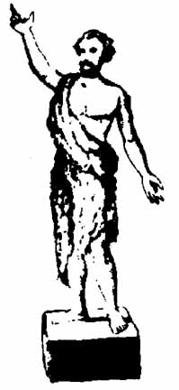

[Sacred-Texts](../../../index) [Christianity](../../index) [Index](index) [Next](gjb-0-1.md)

------------------------------------------------------------------------

# Gnostic John the Baptizer:

------------------------------------------------------------------------

## Selections from the Mandæan John-Book

------------------------------------------------------------------------

#### Together with Studies on John and Christian Origins, the Slavonic Josephus' Account of John and Jesus and the Fourth Gospel Proem.

## *G. R. S. Mead*

 

###### Watkins, London

#### \[1924\]

------------------------------------------------------------------------

[Next: Contents](gjb-0-1.md)
