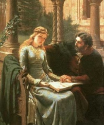

  
[Intangible Textual Heritage](../../index)  [Christianity](../index) 

------------------------------------------------------------------------

[Buy this Book at
Amazon.com](https://www.amazon.com/exec/obidos/ASIN/0486444015/internetsacredte)

------------------------------------------------------------------------

<table width="75%">
<colgroup>
<col style="width: 50%" />
<col style="width: 50%" />
</colgroup>
<tbody>
<tr class="odd">
<td width="50%" data-valign="TOP"></td>
<td width="50%" data-valign="CENTER"><h1 id="the-story-of-my-misfortunes" data-align="CENTER">The Story of My Misfortunes</h1>
<h3 id="the-autobiography-of-peter-abelard" data-align="CENTER">The Autobiography of Peter Abelard</h3>
<h2 id="tr.-by-henry-adams-bellows" data-align="CENTER">tr. by Henry Adams Bellows</h2>
<h4 id="section" data-align="CENTER">[1922]</h4></td>
</tr>
</tbody>
</table>

------------------------------------------------------------------------

[Contents](#contents)    [Start Reading](hc00)

------------------------------------------------------------------------

|                                                                                                                           |
|---------------------------------------------------------------------------------------------------------------------------|
|  |

------------------------------------------------------------------------

 [Title Page](hc00)  
[Foreword](hc01)  
[Chapter I. Of The Birthplace of Pierre Abelard and of His
Parents](hc02)  
[Chapter II. Of The Persecution He Had...](hc03)  
[Chapter III. Of How He Came To Laon To Seek Anselm As Teacher](hc04)  
[Chapter IV. Of The Persecution He Had From His Teacher Anselm](hc05)  
[Chapter V. Of How He Returned to Paris and Finished the Glosses Which
He Had Begun at Laon](hc06)  
[Chapter VI. Of How, Brought Low By His Love For Heloise, He Was Wounded
In Body And Soul](hc07)  
[Chapter VII. Of The Arguments of Heloise Against Wedlock, of How None
the Less He Made Her His Wife](hc08)  
[Chapter VIII. Of The Suffering of His Body, Of How He Became A Monk in
the Monastery of St. Denis and Heloise A Nun at Argenteuil](hc09)  
[Chapter IX. Of His Book on Theology and His Persecution at the Hands of
His Fellow Students of the Council Against Him](hc10)  
[Chapter X. Of The Burning of His Book, of the Persecution He
Had...](hc11)  
[Chapter XI. Of His Teaching in the Wilderness](hc12)  
[Chapter XII. Of the Persecution Directed Against Him By Sundry New
Enemies Or, As It Were, Apostles](hc13)  
[Chapter XIII. Of the Abbey to Which He Was Called and of the
Persecution He Had...](hc14)  
[Chapter XIV. Of the Vile Report of His Iniquity](hc15)  
[Chapter XV. Of the Perils of His Abbey and of the Reasons for the
Writing of This His Letter](hc16)  
