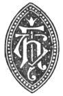

  
[Intangible Textual Heritage](../../index)  [Christianity](../index) 
[Index](index)  [Next](hec01) 

------------------------------------------------------------------------

[Buy this Book on
Kindle](https://www.amazon.com/exec/obidos/ASIN/B002HWRKOI/internetsacredte)

------------------------------------------------------------------------

  
*Hymns of the Eastern Church*, by J.M. Neale, \[1884\], at Intangible
Textual Heritage

------------------------------------------------------------------------

p. 1

#### HYMNS

###### OF

#### The Eastern Church

p. 2

PRINTED BY  
SPOTTISWOODE AND CO., NEW-STREET SQUARE  
LONDON

p. 3

# HYMNS

###### OF

# The Eastern Church.

##### TRANSLATED,

##### WITH NOTES AND AN INTRODUCTION,

###### BY

## THE REV. J: M. Neale, D.D.,

*Warden of Sackville College*.

 

*FIFTH EDITION*.

#### LONDON:

#### J. T. HAYES, 17 HENRIETTA STREET, COVENT GARDEN.

#### \[1884\]

Scanned, proofed and formatted at Intangible Textual Heritage, July
2009, by John Bruno Hare. This text is in the public domain in the US
because it was published prior to 1923.

p. 4

<table data-border="0">
<colgroup>
<col style="width: 100%" />
</colgroup>
<tbody>
<tr class="odd">
<td data-valign="top">
Sion’s lyre, thou best content 
That e’er Heav’n to mortals lent, 
Though they as a trifle leave thee, 
Whose dull thoughts cannot conceive thee, 
Though to them thou be a scorn 
Who to nought but earth are born, 
May my life no longer be 
Than I am in love with thee!

Wither.
</td>
</tr>
</tbody>
</table>

p. 5

TO

THE SUPERIOR

AND

THE OTHER SISTERS

OF

The
House of Mercy at Clewer.

WITH THANKFULNESS FOR THEIR PAST, AND PRAYERS FOR
THEIR FUTURE SUCCESS,

THESE HYMNS

ARE DEDICATED.

------------------------------------------------------------------------

[Next: Contents](hec01)
