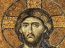

  
[Intangible Textual Heritage](../../index)  [Christianity](../index) 
[Index](index)  [Previous](hec06)  [Next](hec08) 

------------------------------------------------------------------------

[Buy this Book on
Kindle](https://www.amazon.com/exec/obidos/ASIN/B002HWRKOI/internetsacredte)

------------------------------------------------------------------------

  
*Hymns of the Eastern Church*, by J.M. Neale, \[1884\], at Intangible
Textual Heritage

------------------------------------------------------------------------

p. 54

### FIRST EPOCH.

### A.D. 360 . . . A.D. 726.

It is not my intention to dwell on the hymn writers of this period, such
as S. Gregory Nazianzen and S. Sophronius, because their works have not
been employed in the Divine Office, are merely an imitation of classical
writers, and, however occasionally pretty, are not the stuff out of
which Church-song is made. There is but one writer in this epoch who
gives spring-promise of the approaching summer, and that is S.
Anatolius.

------------------------------------------------------------------------

[Next: S. Anatolius](hec08)
