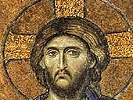

  
[Intangible Textual Heritage](../../index)  [Christianity](../index.md) 
[Index](index)  [Previous](hec36)  [Next](hec38.md) 

------------------------------------------------------------------------

[Buy this Book on
Kindle](https://www.amazon.com/exec/obidos/ASIN/B002HWRKOI/internetsacredte.md)

------------------------------------------------------------------------

  
*Hymns of the Eastern Church*, by J.M. Neale, \[1884\], at Intangible
Textual Heritage

------------------------------------------------------------------------

p. 130

### CANON FOR CHRISTMAS DAY.

This is perhaps the finest, on the whole, of the Canons of Cosmas; and
may fairly be preferred to the rival composition of S. John Damascene.

### ODE I.

by S. Cosmas

Χριστὸς γεννᾶται· δοξάσατε

Christ is born! Tell forth His fame!  
Christ from Heaven! His love proclaim!  
Christ on earth! Exalt His Name!  
Sing to the Lord, O world, with
exultation!  
Break forth in glad thanksgiving, every nation!  
                For He hath triumphed gloriously!

p. 131

Man, in God's own Image made,  
Man, by Satan's wiles betrayed,  
Man, on whom corruption preyed,  
Shut out from hope of life and of salvation,  
To-day Christ maketh him a new
creation,  
                For He hath triumphed gloriously!

For the Maker, when His foe,  
Wrought the creature death and woe,  
Bowed the Heav’ns, and came below, [\*](#fn_3.md)  
And in the Virgin's womb His dwelling making,  
Became true man, man's very nature taking;  
                For He hath triumphed gloriously!

He, the Wisdom, Word, and Might,  
God, and &lt;sc; Son, and Light of
light,  
Undiscovered by the sight p. 132  
Of earthly monarch, or infernal spirit,  
Incarnate was, that we might Heav’n inherit;  
                For He hath triumphed gloriously!

\[In Mr. Young's book. The melody by Dr.
Schroeder.\]

------------------------------------------------------------------------

### Footnotes

[131:\*](hec37.htm#fr_3.md) The reference is, of
course, to Psalm xviii. 9; "He bowed the Heavens also, and came down."

------------------------------------------------------------------------

[Next: Canon For Christmas Day, Ode III.](hec38.md)
