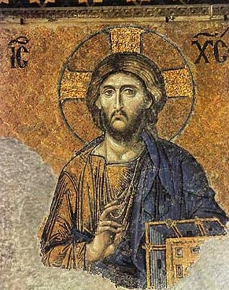

  
[Intangible Textual Heritage](../../index)  [Christianity](../index.md) 

------------------------------------------------------------------------

[Buy this Book on
Kindle](https://www.amazon.com/exec/obidos/ASIN/B002HWRKOI/internetsacredte.md)

------------------------------------------------------------------------

<table width="75%">
<colgroup>
<col style="width: 50%" />
<col style="width: 50%" />
</colgroup>
<tbody>
<tr class="odd">
<td width="50%" data-valign="TOP"></td>
<td width="50%" data-valign="CENTER"><h1 id="hymns-of-the-eastern-church" data-align="CENTER">Hymns of the Eastern Church</h1>
<h2 id="by-j.m.-neale" data-align="CENTER">by J.M. Neale</h2>
<h4 id="section" data-align="CENTER">[1884]</h4></td>
</tr>
</tbody>
</table>

------------------------------------------------------------------------

[Contents](#contents)    [Start Reading](hec00.md)    [Page
Index](pageidx)    [Text \[Zipped\]](hec.txt.gz.md)

------------------------------------------------------------------------

|                                                                                                                           |
|---------------------------------------------------------------------------------------------------------------------------|
|  |

This is a collection of translations of hymns from the Eastern Orthodox
church, most written during the height of the Byzantine Empire. Neale
includes extensive introductory material and biographies of each hymn
writer (most of whom have names beginning with 'S.'--'Saint'). This work
includes some text in Greek, so your browser will have to have good
[Unicode](../../unicode.md) support.

------------------------------------------------------------------------

 [Title Page](hec00.md)  
[Contents](hec01.md)  
[Preface to First Edition](hec02.md)  
[Preface to Second Edition](hec03.md)  
[Preface to Third Edition](hec04.md)  
[Note](hec05.md)  
[Introduction](hec06.md)  
[First Epoch](hec07.md)  

### S. Anatolius

[S. Anatolius](hec08.md)  
[Stichera for a Sunday of the First Tone](hec09.md)  
[Evening Hymn](hec10.md)  
[S. Stephen's Day: Stichera at Vespers](hec11.md)  
[Stichera for Christmas-Tide](hec12.md)  

 

[Second Epoch](hec13.md)  

### S. Andrew

[S. Andrew of Crete](hec14.md)  
[Stichera for Great Thursday](hec15.md)  
[Troparia for Palm Sunday](hec16.md)  
[The Great Canon, Called Also the King of Canons](hec17.md)  
[Stichera for the Second Week of the Great Fast](hec18.md)  

### S. Germanus

[S. Germanus: A Sunday in the Week of the Great Fast](hec19.md)  

### S. John Damascene

[S. John Damascene](hec20.md)  
[Canon for Easter Day, Called the ''Golden Canon,'' or the ''Queen of
Canons''](hec21.md)  
[Canon for Easter Day: Ode I](hec22.md)  
[Canon for Easter Day: Ode III](hec23.md)  
[Canon for Easter Day: Ode IV](hec24.md)  
[Canon for Easter Day: Ode V](hec25.md)  
[Canon for Easter Day: Ode VI](hec26.md)  
[Canon for Easter Day: Ode VII](hec27.md)  
[Canon for Easter Day: Ode VIII](hec28.md)  
[Canon for Easter Day: Ode IX](hec29.md)  
[The Stichera of the Last Kiss](hec30.md)  
[Idiomela for All Saints](hec31.md)  
[S. Thomas's Sunday, Ode I](hec32.md)  
[S. Thomas's Sunday, Ode III](hec33.md)  
[S. Thomas's Sunday, Ode IV](hec34.md)  
[S. Thomas's Sunday, Ode V](hec35.md)  

### S. Cosmas

[S. Cosmas](hec36.md)  
[Canon For Christmas Day, Ode I.](hec37.md)  
[Canon For Christmas Day, Ode III.](hec38.md)  
[Canon For Christmas Day, Ode IV.](hec39.md)  
[Canon For Christmas Day, Ode V.](hec40.md)  
[Canon For Christmas Day, Ode VI.](hec41.md)  
[Canon For Christmas Day, Ode VII.](hec42.md)  
[Canon For Christmas Day, Ode VIII.](hec43.md)  
[Canon For Christmas Day, Ode IX.](hec44.md)  
[Transfiguration](hec45.md)  

### S. Tarasius

[S. Tarasius](hec46.md)  

### S. Theophanes

[S. Theophanes](hec47.md)  
[Idiomela on Friday of Cheese-Sunday](hec48.md)  
[Stichera at the First Vespers of Cheese-Sunday](hec49.md)  

### Theodore of the Studium

[Theodore of the Studium](hec50.md)  
[Canon for Apocreos](hec51.md)  
[Canon for Apocreos. Ode I](hec52.md)  
[Canon for Apocreos. Ode III](hec53.md)  
[Canon for Apocreos. Ode IV](hec54.md)  
[Canon for Apocreos. Ode IX](hec55.md)  
[Orthodoxy Sunday](hec56.md)  

### S. Methodius I.

[S. Methodius I. Idiomela for a Sunday of the Fourth Tone](hec57.md)  

### S. Joseph of the Studium

[S. Joseph of the Studium](hec58.md)  
[Sunday of the Prodigal Son. (Septuagesima.)](hec59.md)  
[Let Our Choir New Anthems Raise](hec60.md)  
[And Wilt Thou Pardon, Lord](hec61.md)  
[Stars of the Morning](hec62.md)  
[Canon for Ascension Day. Ode I.](hec63.md)  
[Canon for Ascension Day. Ode III.](hec64.md)  
[Canon for Ascension Day. Ode IV.](hec65.md)  
[Canon for Ascension Day. Ode V.](hec66.md)  
[Canon for Ascension Day. Ode VI.](hec67.md)  
[Canon for Ascension Day. Ode VII.](hec68.md)  
[Canon for Ascension Day. Ode VIII.](hec69.md)  
[Canon for Ascension Day. Ode IX.](hec70.md)  

### Theoctistus of the Studium

[Theoctistus of the Studium](hec71.md)  

### Metrophanes of Smyrna

[Metrophanes of Smyrna](hec72.md)  
[O Unity of Threefold Light](hec73.md)  

 

[Euthymius](hec74.md)  
[Leo VI](hec75.md)  
[John Mauropus](hec76.md)  

### Appendix

### S. Stephen the Sabaite

[S. Stephen the Sabaite](hec77.md)  
[Idiomela in the Week of the First Oblique Tone](hec78.md)  

### S. Joseph of the Studium

[The Pilgrims of Jesus](hec79.md)  
[The Return Home](hec80.md)  

 

[Advertisements](hec81.md)  
