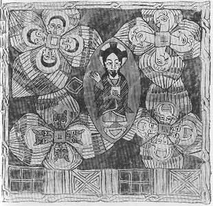

  
[Intangible Textual Heritage](../../index)  [Christianity](../index) 
[Africa](../../afr/index)  [Index](index)  [Previous](kn118) 
[Next](03) 

------------------------------------------------------------------------

  
*The Kebra Nagast*, by E.A. Wallis Budge, \[1932\], at Intangible
Textual Heritage

------------------------------------------------------------------------

PLATE II

 

God Almighty the ancient of Days (Daniel vii. 9) surrounded by the
"living creatures" seen by Ezekiel

*From Brit. Mus. Orient. No. 481, fol. 110 a*

------------------------------------------------------------------------

[Next: III.](03)

