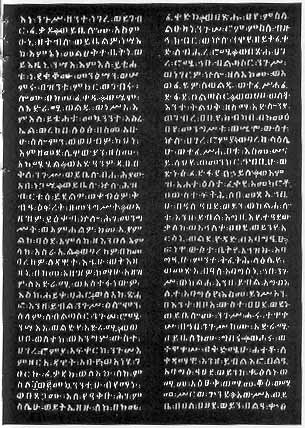

  
[Intangible Textual Heritage](../../index)  [Christianity](../index) 
[Africa](../../afr/index)  [Index](index)  [Previous](02)  [Next](04) 

------------------------------------------------------------------------

  
*The Kebra Nagast*, by E.A. Wallis Budge, \[1932\], at Intangible
Textual Heritage

------------------------------------------------------------------------

PLATE III

 

Two columns of the Ethiopic Text of the Book of the Glory of Kings of
Ethiopia

*From Brit. Mus. Orient. No. 818, fol. 26 a, cols. 1
and 2*

------------------------------------------------------------------------

[Next: IV.](04)

