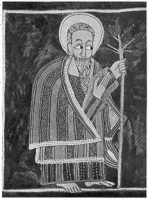

  
[Intangible Textual Heritage](../../index)  [Christianity](../index) 
[Africa](../../afr/index)  [Index](index)  [Previous](05)  [Next](07) 

------------------------------------------------------------------------

  
*The Kebra Nagast*, by E.A. Wallis Budge, \[1932\], at Intangible
Textual Heritage

------------------------------------------------------------------------

PLATE VI

 

Aaron holding in his left hand his rod which blossomed

*From Brit. Mus. Orient. No. 481, fol. 34 b*

------------------------------------------------------------------------

[Next: VII.](07)

