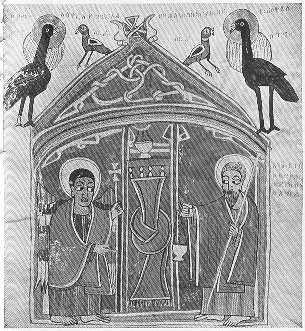

  
[Intangible Textual Heritage](../../index)  [Christianity](../index.md) 
[Africa](../../afr/index)  [Index](index)  [Previous](06)  [Next](08.md) 

------------------------------------------------------------------------

  
*The Kebra Nagast*, by E.A. Wallis Budge, \[1932\], at Intangible
Textual Heritage

------------------------------------------------------------------------

PLATE VII

 

The Archangel Gabriel appearing to Zacharias as he ministered at the
altar in the Sanctuary

*From Brit. Mus. Orient. No. 481, fol. 99 a*

------------------------------------------------------------------------

[Next: VIII.](08.md)

