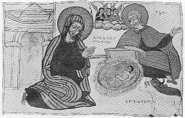

  
[Intangible Textual Heritage](../../index)  [Christianity](../index) 
[Africa](../../afr/index)  [Index](index)  [Previous](10)  [Next](12) 

------------------------------------------------------------------------

  
*The Kebra Nagast*, by E.A. Wallis Budge, \[1932\], at Intangible
Textual Heritage

------------------------------------------------------------------------

PLATE XI

 

The Nativity. "Jesus lying in a manger" edged with straw. Above, on
clouds, are the angels of heaven; on the right, the ass and the ox which
wamed the stable with their breath

*From Brit. Mus. Orient. No. 510, fol. 8 b*

------------------------------------------------------------------------

[Next: XII.](12)

