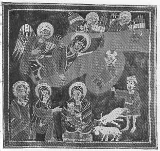

  
[Intangible Textual Heritage](../../index)  [Christianity](../index) 
[Africa](../../afr/index)  [Index](index)  [Previous](11)  [Next](13) 

------------------------------------------------------------------------

  
*The Kebra Nagast*, by E.A. Wallis Budge, \[1932\], at Intangible
Textual Heritage

------------------------------------------------------------------------

PLATE XII

 

1\. The angels appearing to Mary at the birth of Christ  
2. The ox and the ass bowing before Christ

*From Brit. Mus. Orient. No. 481, fol. 100 b*

------------------------------------------------------------------------

[Next: XIII.](13)

