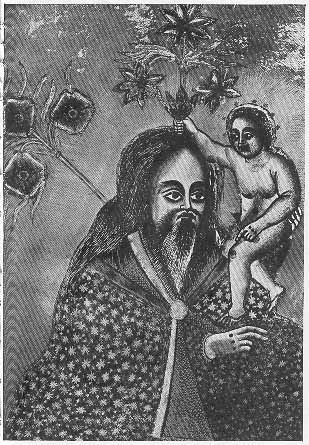

  
[Intangible Textual Heritage](../../index)  [Christianity](../index) 
[Africa](../../afr/index)  [Index](index)  [Previous](12)  [Next](14) 

------------------------------------------------------------------------

  
*The Kebra Nagast*, by E.A. Wallis Budge, \[1932\], at Intangible
Textual Heritage

------------------------------------------------------------------------

PLATE XIII

 

The old man Simeon carrying Christ in his arms

*From Brit. Mus. Orient. No. 620, fol. 1 a*

------------------------------------------------------------------------

[Next: XIV.](14)

