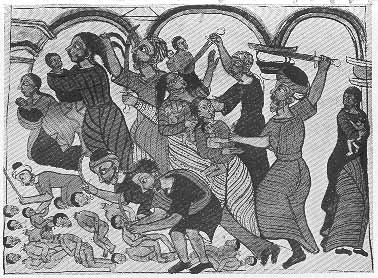

  
[Intangible Textual Heritage](../../index)  [Christianity](../index.md) 
[Africa](../../afr/index)  [Index](index)  [Previous](13)  [Next](15.md) 

------------------------------------------------------------------------

  
*The Kebra Nagast*, by E.A. Wallis Budge, \[1932\], at Intangible
Textual Heritage

------------------------------------------------------------------------

PLATE XIV

 

The Slaughter of the Innocents

*From Brit. Mus. Orient. No. 550, fol. 10 b*

------------------------------------------------------------------------

[Next: XV.](15.md)

