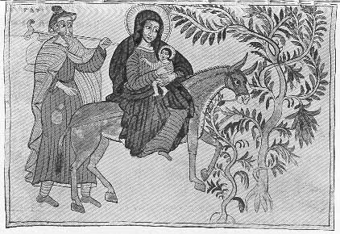

  
[Intangible Textual Heritage](../../index)  [Christianity](../index) 
[Africa](../../afr/index)  [Index](index)  [Previous](14)  [Next](16) 

------------------------------------------------------------------------

  
*The Kebra Nagast*, by E.A. Wallis Budge, \[1932\], at Intangible
Textual Heritage

------------------------------------------------------------------------

PLATE XV

 

The Virgin and Child and Joseph fleeing to Egypt

*From Brit. Mus. Orient. No. 510, fol. 10 a*

------------------------------------------------------------------------

[Next: XVI.](16)

