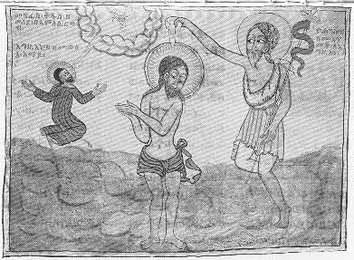

  
[Intangible Textual Heritage](../../index)  [Christianity](../index.md) 
[Africa](../../afr/index)  [Index](index)  [Previous](16)  [Next](18.md) 

------------------------------------------------------------------------

  
*The Kebra Nagast*, by E.A. Wallis Budge, \[1932\], at Intangible
Textual Heritage

------------------------------------------------------------------------

PLATE XVII

 

1\. John the Baptist baptizing Christ in the Jordan  
2. The heavenly dove hovering over Christ as He leaves the water

*From Brit. Mus. Orient. No. 510, fol. 12 a*

------------------------------------------------------------------------

[Next: XVIII.](18.md)

