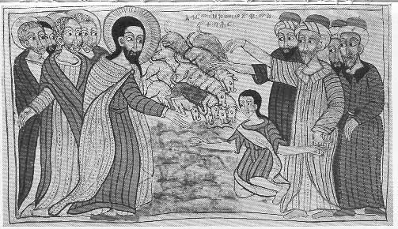

  
[Intangible Textual Heritage](../../index)  [Christianity](../index) 
[Africa](../../afr/index)  [Index](index)  [Previous](18)  [Next](20) 

------------------------------------------------------------------------

  
*The Kebra Nagast*, by E.A. Wallis Budge, \[1932\], at Intangible
Textual Heritage

------------------------------------------------------------------------

PLATE XIX

 

The Gadarene swine rushing down into the sea

*From Brit. Mus. Orient. No. 510, fol. 22 a*

------------------------------------------------------------------------

[Next: XX.](20)

