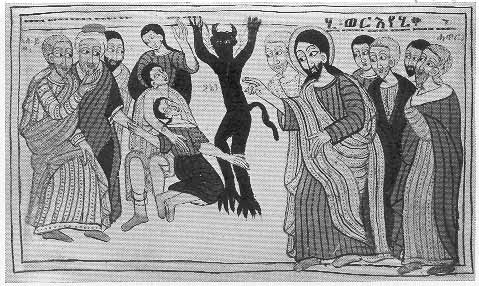

  
[Intangible Textual Heritage](../../index)  [Christianity](../index) 
[Africa](../../afr/index)  [Index](index)  [Previous](19)  [Next](21) 

------------------------------------------------------------------------

  
*The Kebra Nagast*, by E.A. Wallis Budge, \[1932\], at Intangible
Textual Heritage

------------------------------------------------------------------------

PLATE XX

 

Christ casting a devil out of a man in the presence of the Jews and His
Apostles

*From Brit. Mus. Orient. No. 510, fol. 312*

------------------------------------------------------------------------

[Next: XXI.](21)

