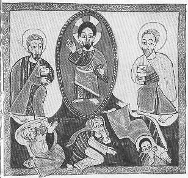

  
[Intangible Textual Heritage](../../index)  [Christianity](../index.md) 
[Africa](../../afr/index)  [Index](index)  [Previous](20)  [Next](22.md) 

------------------------------------------------------------------------

  
*The Kebra Nagast*, by E.A. Wallis Budge, \[1932\], at Intangible
Textual Heritage

------------------------------------------------------------------------

PLATE XXI

 

The Transfiguration. Christ in converse with Moses and Elias on Mount
Tabor

*From Brit. Mus. Orient. No. 481, fol. 102 b*

------------------------------------------------------------------------

[Next: XXII.](22.md)

