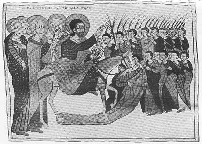

  
[Intangible Textual Heritage](../../index)  [Christianity](../index) 
[Africa](../../afr/index)  [Index](index)  [Previous](22)  [Next](24) 

------------------------------------------------------------------------

  
*The Kebra Nagast*, by E.A. Wallis Budge, \[1932\], at Intangible
Textual Heritage

------------------------------------------------------------------------

PLATE XXIII

 

Christ riding into Jerusalem on an ass on the "Day of Hosanna" (Palm
Sunday)

*From Brit. Mus. Orient. No. 510, fol. 52 a*

------------------------------------------------------------------------

[Next: XXIV.](24)

