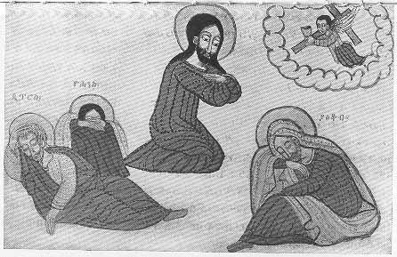

  
[Intangible Textual Heritage](../../index)  [Christianity](../index) 
[Africa](../../afr/index)  [Index](index)  [Previous](23)  [Next](25) 

------------------------------------------------------------------------

  
*The Kebra Nagast*, by E.A. Wallis Budge, \[1932\], at Intangible
Textual Heritage

------------------------------------------------------------------------

PLATE XXIV

 

An angel bringing the Cross and the cup to Christ in the Garden of
Gethsemane. By Him are Peter, John, and James asleep

*From Brit. Mus. Orient. No. 510, fol. 66 a*

------------------------------------------------------------------------

[Next: XXV.](25)

