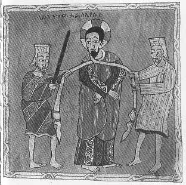

  
[Intangible Textual Heritage](../../index)  [Christianity](../index.md) 
[Africa](../../afr/index)  [Index](index)  [Previous](24)  [Next](26.md) 

------------------------------------------------------------------------

  
*The Kebra Nagast*, by E.A. Wallis Budge, \[1932\], at Intangible
Textual Heritage

------------------------------------------------------------------------

PLATE XXV

 

The soldiers binding Christ

*From Brit. Mus. Orient. No. 481, fol. 105 a*

------------------------------------------------------------------------

[Next: XXVI.](26.md)

