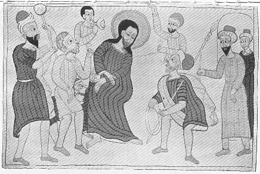

  
[Intangible Textual Heritage](../../index)  [Christianity](../index) 
[Africa](../../afr/index)  [Index](index)  [Previous](25)  [Next](27) 

------------------------------------------------------------------------

  
*The Kebra Nagast*, by E.A. Wallis Budge, \[1932\], at Intangible
Textual Heritage

------------------------------------------------------------------------

PLATE XXVI

 

The soldiers tying Christ's hands and spitting in His face

*From Brit. Mus. Orient. No. 510, fol. 68 a*

------------------------------------------------------------------------

[Next: XXVII.](27)

