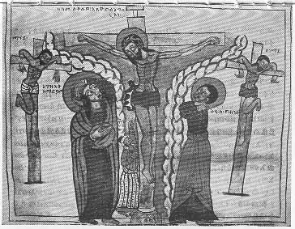

  
[Intangible Textual Heritage](../../index)  [Christianity](../index.md) 
[Africa](../../afr/index)  [Index](index)  [Previous](26)  [Next](28.md) 

------------------------------------------------------------------------

  
*The Kebra Nagast*, by E.A. Wallis Budge, \[1932\], at Intangible
Textual Heritage

------------------------------------------------------------------------

PLATE XXVII

 

How the Jews crucified our Lord. The Virgin Mary stands on His right and
St. John on His left. Between the Virgin and the Cross stands Longinus,
the soldier who pierced our Lord's side. The Crusaders are said to have
found the body of Longinus in the church of St. Peter at Antioch in the
XIth century

*From Brit. Mus. Orient. No. 510, fol. 72 a*

------------------------------------------------------------------------

[Next: XXVIII.](28.md)

