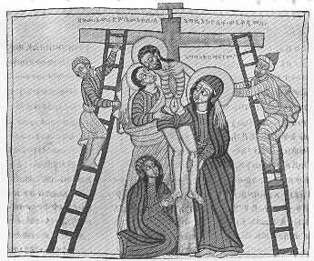

  
[Intangible Textual Heritage](../../index)  [Christianity](../index.md) 
[Africa](../../afr/index)  [Index](index)  [Previous](27)  [Next](29.md) 

------------------------------------------------------------------------

  
*The Kebra Nagast*, by E.A. Wallis Budge, \[1932\], at Intangible
Textual Heritage

------------------------------------------------------------------------

PLATE XXVIII

 

Joseph of Arimathea and Nicodemus taking Christ down from the Cross

*From Brit. Mus. Orient. No. 510, fol. 73 a*

------------------------------------------------------------------------

[Next: XXIX.](29.md)

