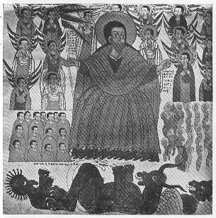

  
[Intangible Textual Heritage](../../index)  [Christianity](../index) 
[Africa](../../afr/index)  [Index](index)  [Previous](30)  [Next](32) 

------------------------------------------------------------------------

  
*The Kebra Nagast*, by E.A. Wallis Budge, \[1932\], at Intangible
Textual Heritage

------------------------------------------------------------------------

PLATE XXXI

 

The Last Judgement. God Almighty, holding a standard with flags attached
to it, sits in the centre with His angels about Him. On His right are
seated the blessed, clothed, and on His left are the damned in the form
of naked men and women. At His feet lie 'Diabolus, the lover of
iniquity' and two other fiends

*From Brit. Mus. Orient. No. 510, fol. 62 b*

------------------------------------------------------------------------

[Next: XXXII.](32)

