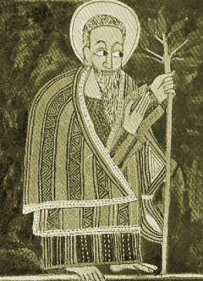

  
[Intangible Textual Heritage](../../index)  [Christianity](../index) 
[Africa](../../afr/index) 

------------------------------------------------------------------------

<table width="75%">
<colgroup>
<col style="width: 50%" />
<col style="width: 50%" />
</colgroup>
<tbody>
<tr class="odd">
<td width="50%" data-valign="TOP"></td>
<td width="50%" data-valign="CENTER"><h1 id="the-kebra-nagast" data-align="CENTER">The Kebra Nagast</h1>
<h2 id="by-e.a.-wallis-budge" data-align="CENTER">by E.A. Wallis Budge</h2>
<h4 id="section" data-align="CENTER">[1932]</h4></td>
</tr>
</tbody>
</table>

------------------------------------------------------------------------

[Contents](#contents)    [Start Reading](kn000-0)    [Text
\[Zipped\]](kn.txt.gz)

------------------------------------------------------------------------

------------------------------------------------------------------------

 [Title Page](kn000-0)  
[PREFACE TO THE PRESENT EDITION](kn000-1)  
[PREFACE TO THE FIRST EDITION](kn000-2)  
[CONTENTS.](kn000-3)  
[LIST OF PLATES](kn000-4)  
[INTRODUCTION](kn000-5)  
[1. Concerning the Glory of Kings](kn001)  
[2. Concerning the Greatness of Kings](kn002)  
[3. Concerning the Kingdom of ADAM](kn003)  
[4. Concerning Envy](kn004)  
[5. Concerning the Kingdom of SETH](kn005)  
[6. Concerning the Sin of CAIN](kn006)  
[7. Concerning NOAH](kn007)  
[8. Concerning the Flood](kn008)  
[9. Concerning the Covenant of NOAH](kn009)  
[10. Concerning ZION](kn010)  
[11. The Unanimous Declaration of the Three Hundred and Eighteen
Orthodox Fathers](kn011)  
[12. Concerning CANAAN](kn012)  
[13. Concerning ABRAHAM](kn013)  
[14. Concerning the Covenant of ABRAHAM](kn014)  
[15. Concerning ISAAC and JACOB](kn015)  
[16. Concerning RÔBÊL (REUBEN)](kn016)  
[17. Concerning the Glory of ZION](kn017)  
[18. How the Orthodox Fathers and Bishops Agreed](kn018)  
[19. How this Book came to be found](kn019)  
[20. Concerning the Division of the Earth](kn020)  
[21. Concerning the Queen of the South](kn021)  
[22. Concerning TÂMRÎN, the Merchant](kn022)  
[23. How the Merchant returned to ETHIOPIA](kn023)  
[24. How the Queen made ready to set out on her Journey](kn024)  
[25. How the Queen came to SOLOMON the King](kn025)  
[26. How the King held converse with the Queen](kn026)  
[27. Concerning the Labourer](kn027)  
[28. How SOLOMON gave Commandments to the Queen](kn028)  
[29. Concerning the Three Hundred and Eighteen \[Patriarchs\]](kn029)  
[30. Concerning how King SOLOMON swore to the Queen](kn030)  
[31. Concerning the sign which SOLOMON gave the Queen](kn031)  
[32. How the Queen brought forth and came to her own Country](kn032)  
[33. How the King of ETHIOPIA travelled](kn033)  
[34. How the young man arrived in his mother's country](kn034)  
[35. How King SOLOMON sent to his son the commander of his
army](kn035)  
[36. How King SOLOMON held intercourse with his son](kn036)  
[37. How SOLOMON asked His Son Questions](kn037)  
[38. How the King planned to send away his son with the children of the
nobles](kn038)  
[39. How they made the Son of SOLOMON King](kn039)  
[40. How ZADOK the priest gave commands to DAVID the King](kn040)  
[41. Concerning the blessing of Kings](kn041)  
[42. Concerning the Ten Commandments](kn042)  
[43. How the men of the Army of ISRAEL received \[their\]
orders](kn043)  
[44. How it is not a seemly thing to revile the King](kn044)  
[45. How those who were sent away wept and made a plan](kn045)  
[46. How they made a plan concerning ZION](kn046)  
[47. Concerning the offering of AZÂRYÂS (AZARIAH) and the King](kn047)  
[48. How they carried away ZION](kn048)  
[49. How his Father blessed his Son](kn049)  
[50. How they bade farewell to his Father and how the city
mourned](kn050)  
[51. How he said unto ZADOK the Priest, ''Go and bring the Covering (or,
Clothing) which is upon it (i.e., ZION)''](kn051)  
[52. How ZADOK the Priest Departed](kn052)  
[53. How the Wagon was given to ETHIOPIA](kn053)  
[54. How DAVID \[the King of ETHIOPIA\] Prophesied and Saluted
ZION](kn054)  
[55. How the People of ETHIOPIA Rejoiced](kn055)  
[56. Of the Return of ZADOK the Priest, and the giving of the
Gift](kn056)  
[57. Concerning the Fall of ZADOK the Priest](kn057)  
[58. How SOLOMON Rose up to Slay them](kn058)  
[59. How the King Questioned an Egyptian, the Servant of
PHARAOH](kn059)  
[60. How SOLOMON Lamented for ZION](kn060)  
[61. How SOLOMON Returned to JERUSALEM](kn061)  
[62. Concerning the answer which SOLOMON made to them](kn062)  
[63. How the Nobles of ISRAEL agreed \[with the King\]](kn063)  
[64. How the Daughter of PHARAOH Seduced SOLOMON](kn064)  
[65. Concerning the sin of SOLOMON](kn065)  
[66. Concerning the prophecy of CHRIST](kn066)  
[67. Concerning the lamentation of SOLOMON](kn067)  
[68. Concerning MARY, Our Lady of Salvation](kn068)  
[69. Concerning the Question of SOLOMON](kn069)  
[70. How REHOBOAM reigned](kn070)  
[71. Concerning MARY, the daughter of DAVID](kn071)  
[72. Concerning the King of RÔMÊ (CONSTANTINOPLE)](kn072)  
[73. Concerning the first judgment of ’ADRÂMÎ, King of RÔMÊ](kn073)  
[74. Concerning the King of MEDYÂM](kn074)  
[75. Concerning the King of BABYLON](kn075)  
[76. Concerning lying witnesses](kn076)  
[77. Concerning the King of PERSIA](kn077)  
[78. Concerning the King of MOAB](kn078)  
[79. Concerning the King of AMALEK](kn079)  
[80. Concerning the King of the PHILISTINES](kn080)  
[81. How the son of SAMSON slew the son of the King of the
PHILISTINES](kn081)  
[82. Concerning the going down of ABRAHAM into EGYPT](kn082)  
[83. Concerning the King of the ISHMAELITES](kn083)  
[84. Concerning the King of ETHIOPIA and how he returned to his
country](kn084)  
[85. Concerning the rejoicing of Queen MÂKĔDÂ](kn085)  
[86. How Queen MÂKĔDÂ made her son King](kn086)  
[87. How the nobles (or governors) of ETHIOPIA took the oath](kn087)  
[88. How he himself related to his mother how they made him
King](kn088)  
[89. How the Queen talked to the Children of ISRAEL](kn089)  
[90. How AZARIAH praised the Queen and her city](kn090)  
[91. This is what ye shall eat: the clean and the unclean](kn091)  
[92. How they renewed the kingdom of DAVID](kn092)  
[93. How the Men of RÔMÊ destroyed the Faith](kn093)  
[94. The first war of the King of ETHIOPIA](kn094)  
[95. How the honourable estate of the King of ETHIOPIA was universally
accepted](kn095)  
[96. Concerning the Prophecy about CHRIST](kn096)  
[97. Concerning the Murmuring of ISRAEL](kn097)  
[98. Concerning the Rod of MOSES and the Rod of AARON](kn098)  
[99. Concerning the Two Servants](kn099)  
[100. Concerning the Angels who rebelled](kn100)  
[101. Concerning Him that existeth in Everything and
Everywhere](kn101)  
[102. Concerning the Beginning](kn102)  
[103. Concerning the Horns of the Altar](kn103)  
[104. More concerning the Ark and the Talk of the Wicked](kn104)  
[105. Concerning the belief of ABRAHAM](kn105)  
[106. A Prophecy concerning the Coming of CHRIST](kn106)  
[107. Concerning His entrance into JERUSALEM in Glory](kn107)  
[108. Concerning the wickedness of the iniquitous JEWS](kn108)  
[109. Concerning His Crucifixion](kn109)  
[110. Concerning His Resurrection](kn110)  
[111. Concerning His Ascension and His Second Coming](kn111)  
[112. How the Prophets foreshadowed Him in their persons](kn112)  
[113. Concerning the Chariot and the Vanquisher of the Enemy](kn113)  
[114. Concerning the return of ZION](kn114)  
[115. Concerning the Judgement of ISRAEL](kn115)  
[116. Concerning the Chariot of ETHIOPIA](kn116)  
[117. Concerning the King of RÔMÊ and the King of ETHIOPIA](kn117)  
[Colophon](kn118)  
[II.](02)  
[III.](03)  
[IV.](04)  
[V.](05)  
[VI.](06)  
[VII.](07)  
[VIII.](08)  
[IX.](09)  
[X.](10)  
[XI.](11)  
[XII.](12)  
[XIII.](13)  
[XIV.](14)  
[XV.](15)  
[XVI.](16)  
[XVII.](17)  
[XVIII.](18)  
[XIX.](19)  
[XX.](20)  
[XXI.](21)  
[XXII.](22)  
[XXIII.](23)  
[XXIV.](24)  
[XXV.](25)  
[XXVI.](26)  
[XXVII.](27)  
[XXVIII.](28)  
[XXIX.](29)  
[XXX.](30)  
[XXXI.](31)  
[XXXII.](32)  
