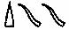

  
[Intangible Textual Heritage](../../index)  [Christianity](../index) 
[Africa](../../afr/index)  [Index](index)  [Previous](kn000-1) 
[Next](kn000-3) 

------------------------------------------------------------------------

  
*The Kebra Nagast*, by E.A. Wallis Budge, \[1932\], at Intangible
Textual Heritage

------------------------------------------------------------------------

p. xv

## PREFACE TO THE FIRST EDITION

   This volume contains a complete English translation of the famous
Ethiopian work, The "KEBRA NAGAST", i.e. the
"Glory of the Kings \[of ETHIOPIA\]". This
work has been held in peculiar honour in ABYSSINIA for several centuries, and throughout
that country it has been, and still is, venerated by the people as
containing the final proof of their descent from the Hebrew Patriarchs,
and of the kinship of their kings of the Solomonic line with CHRIST, the Son of God. The importance of the book,
both for the kings and the people of ABYSSINIA, is clearly shown by the letter that King
JOHN of ETHIOPIA
wrote to the late Lord GRANVILLE in August,
1872. The king says: "There is a book called 'Kivera Negust' which
contains the Law of the whole of ETHIOPIA,
and the names of the SHÛMS \[i.e. Chiefs\],
and Churches, and Provinces are in this book. I pray you find out who
has got this book, and send it to me, for in my country my people will
not obey my orders without it." (See *infra*, p. xxxv). The first
summary of the contents of the KEBRA NAGAST
was published by BRUCE as far back as 1813,
but little interest was roused by his somewhat bald précis. And, in
spite of the labours of PRÆTORIUS, BEZOLD, and HUGUES LE
ROUX, the contents of the work are still practically unknown to
the general reader in England. It is hoped that the translation given in
the following pages will be of use to those who have not the time or
opportunity for perusing the Ethiopic original.

   The KEBRA NAGAST is a great storehouse of
legends and traditions, some historical and some of a purely folk-lore
character, derived from the Old Testament and the later Rabbinic
writings, and from Egyptian (both pagan and Christian), Arabian, and
Ethiopian sources. Of the early history of the compilation and its
maker, and of its subsequent editors we know nothing, but the principal
p. xvi groundwork of its earliest form was
the traditions that were current in SYRIA,
PALESTINE, ARABIA,
and EGYPT during the first four centuries of
the Christian era. Weighing carefully all that has been written by DILLMANN, TRUMP, ZOTENBERG, WRIGHT, and
BEZOLD, and taking into account the
probabilities of the matter, it seems to me that we shall not be far
wrong if we assign the composition of the earliest form of the KEBRA NAGAST to the sixth century A.D. Its compiler was probably a Coptic priest, for
the books he used were writings that were accepted by the Coptic Church.
Whether he lived in EGYPT, or in AKSÛM, or in some other part of ETHIOPIA matters little, but the colophons of the
extant Ethiopic MSS. of the KEBRA NAGAST
suggest that he wrote in Coptic.

   In the succeeding centuries, probably as a result of the widespread
conquests of MUḤAMMAD and his KHALÎFAHS, the Coptic text was in whole or part
translated into Arabic, and during the process of translation many
additions were made to it, chiefly from Arabic sources. Last of all this
Arabic version was translated into Ethiopic, and proper names underwent
curious transformations in the process. According to the colophons of
the MSS. in the BRITISH MUSEUM, OXFORD, and PARIS, the
Arabic translation was made from the Coptic in the 409th "year of
mercy", when GABRA MASḲAL, commonly known as
LÂLÎBALÂ, was reigning over ETHIOPIA, i.e. between A.D. 1314 and 1344. And the same authorities say
that the Ethiopic translation was made subsequently by one ISAAC, of whom nothing is known save that he was an
enthusiastic Christian visionary and patriot. His knowledge of history
and chronology was defective, and his comparative philology is unusually
peculiar, even for the period in which he lived.

   In the colophons ISAAC says: "I have
toiled much for the glory of the kingdom of ETHIOPIA, and for the going forth (manifestation ?)
of the heavenly ZION, and for the glory of
the King of ETHIOPIA." These words throw
p. xvii some light upon ISAAC'S motive in translating the book, and supply
the reason for his devoted labour. He firmly believed: 1. That the
lawful kings of ETHIOPIA were descended from
SOLOMON, King of ISRAEL. 2. That the Tabernacle of the Law of God,
i.e. the Ark of the Covenant, had been brought from JERUSALEM to ’AKSÛM by
MENYELEK, SOLOMON'S firstborn son, according to the ETHIOPIANS. 3. That the God of ISRAEL had transferred His place of abode on earth
from JERUSALEM to ’AKSÛM (AXUM), the
ecclesiastical and political capital of ETHIOPIA. The means employed by MENYELEK for obtaining possession of the Ark of the
Covenant did not disturb ISAAC'S conscience
in the least, nay he gloried in them, for manifestly MENYELEK was performing the Will of God in removing
the tabernacle of ZION from JERUSALEM. God, according to ISAAC, was satisfied that the JEWS were unworthy to be custodians of the Ark
wherein His Presence was, and the Ark wished to depart. ETHIOPIA had stretched out her hands to God (Psalm
lxviii. 31), and He went to her, with the Ark, to preside over MENYELEK'S kingdom, which was established in
accordance with the commands that He had given to MOSES and the prophets and priests of ISRAEL.

   It will be remembered that the line of kings founded by SOLOMON continued to reign even after the ETHIOPIANS became Christians under the teaching of
FRUMENTIUS and ADESIUS, the slaves of the merchant MEROPIUS, and that the line continued unbroken
until the tenth century of our era. ISAAC
knew that God then permitted the line to be broken, and allowed the
ZÂGUÊ kings to reign over ETHIOPIA until the reign of YĔKÛNÔ ’AMLÂK, who restored the Solomonic line in
1270, and he makes no attempt to justify God's action in this matter, or
to explain it. We learn, however, from the first section of the
colophon, that he wondered why God had neglected to have the Arabic
version of the KEBRA NAGAST translated into
the "speech of ABYSSINIA" at an p. xviii earlier date, and why ’ABU’L-’IZZ and ’ABU’L-FARAJ, who made the Arabic translation from
the Coptic, did not make a rendering into Ethiopic also. In the
explanation which he attempts to give, he reminds us that the Arabic
translation appeared whilst the ZÂGUÊ kings
were still reigning. As the KEBRA NAGAST was
written to glorify the Solomonic line of kings, and its editors and
translators regarded the ZÂGUÊ kings not only
as non-ISRAELITES, but as "transgressors of
the Law", the appearance of a translation of it in the vernacular whilst
the ZÂGUÊ were still on the throne would be
followed by the torture and death of its producers, and the destruction
of their work.

   There is extant in Ethiopian literature a legend to the effect that
when God made ADAM He placed in his body a
"Pearl", which He intended should pass from it into the bodies of a
series of holy men, one after the other, until the appointed time when
it should enter the body of ḤANNÂ,[1](#page_xviii_note_1) and form the substance
of her daughter the VIRGIN MARY. Now this
"Pearl" passed through the body of SOLOMON,
an ancestor of CHRIST, and CHRIST and MENYELEK, the
son of SOLOMON by the Queen of SHEBA, were sons of SOLOMON, and according to Ethiopian ideas they were
akin to each other. But CHRIST was the Son of
God, and, therefore, being the kinsman of CHRIST, MENYELEK was
divine. And ISAAC the Ethiopian, holding this
view, maintains in the KEBRA NAGAST that the
kings of ETHIOPIA who were descended from
MENYELEK were of divine origin, and that
their words and deeds were those of gods.

   Now the idea of the divine origin of kings in ETHIOPIA, the SÛDÂN, and
EGYPT, is very old, and it appears to have
been indigenous. According to a legend given in the WESTCAR PAPYRUS in BERLIN, three of the great kings of the Vth dynasty
in EGYPT were the sons of the god RĀ by RUṬṬEṬ, the wife
of RUṬṬEṬUSER, high priest of RĀ, and p. xix before
the close of that dynasty every king called himself "son of RĀ". Many a king of EGYPT states in his inscriptions that he reigned
"in the egg", i.e. before he was born, and we are to understand that the
egg was deposited in his mother by the form of the Sun-god, who was his
father. Some of the sovereigns of the XVIIIth dynasty, certainly those
who were the nominees of the priests of ȦMEN,
were declared to be the actual children of ȦMEN, and to be of his substance. On the walls of
the famous temple which the architect SENMUT
built for Queen ḤATSHEPSUT in Western THEBES, there is a series of bas-reliefs in which
the god ȦMEN is seen companying with the
mother of that Queen, and ḤATSHEPSUT regarded
herself as ȦMEN'S daughter. In the temple of
Luxor there are bas-reliefs of a similar character, and the god ȦMEN is seen occupying the couch of the queen who
became by him the mother of ȦMENḤETEP III.
This king was so thoroughly convinced of his divine origin that he
caused an effigy of himself to be sculptured on the walls of the temple
of SÛLB in the Egyptian SÛDÂN, together with the figures of the great gods
of EGYPT. In fact he shared the worship of
the people with the gods and goddesses of EGYPT. RAMESES THE GREAT
was held to be the son of the god PTAḤ-TANEN,
and in the inscription on a stele at ABU
SIMBEL this god, in addressing the king, says: "I am thy father.
Thou was begotten by the gods. All thy members are from the gods. I made
myself assume the form of the RAM, the Lord
of Tet-t, my seed stood in thy august mother"

 [1](#page_xix_note_1)

p. xx

   A thousand years later a story arose in EGYPT to the effect that ALEXANDER THE GREAT was the son of the god ȦMEN of EGYPT, and ALEXANDER'S councillors promptly took advantage of
it to forward the fortunes of their lord. If, they argued, ALEXANDER is the son of ȦMEN, he is the lawful king of EGYPT, and the EGYPTIANS
must acknowledge him as their king. But it was necessary for their
purpose that ȦMEN should acknowledge ALEXANDER as his son, and they therefore took him
to the Oasis of SÎWAH in the Libyan Desert,
and presented him to the god ȦMEN of LIBYA. The god admitted that ALEXANDER was his son, the priesthood of ȦMEN accepted the declaration of their god, the
EGYPTIANS believed that the holy blood of
ȦMEN flowed in ALEXANDER'S veins, and as a result he became the
king of the South and the North, and Governor of the Domain of HORUS without striking a blow. The native novelists
and story-tellers, e.g. the PSEUDO
CALLISTHENES, declared that when NECTANEBUS II, the last native king of EGYPT, fled from EGYPT
he went to MACEDON, where he established
himself as a magician. Here he became acquainted with Queen OLYMPIAS, who wished to find out from him if her
husband, PHILIP, intended to put her away. An
intimacy sprang up between NECTANEBUS and
OLYMPIAS, and he appeared to the queen one
night in the form of the god ȦMEN of LIBYA, arrayed in all the attributes of the god,
and begot ALEXANDER THE GREAT. Tradition
transferred the horns of ȦMEN to ALEXANDER, and ancient Arab writers call ALEXANDER "DHU’L-ḲARNÊN", i.e. "provided with two horns", a
title that translates exactly one of the titles of ȦMEN, "Sepṭ ābui" 

   ISAAC, the editor and translator of the
KEBRA NAGAST, and his fellow countrymen saw
nothing strange in the fact that MÂKĔDÂ, the
virgin queen of SÂBA, gave herself to SOLOMON, for she believed him to be of divine
origin, and he was to her as a god. Moreover, he was p. xxi the custodian of the "Heavenly ZION, the Tabernacle of the Law of God", whence he
obtained daily the renewal of his divinity, and power, and authority.
The Tabernacle of the Law had much in common with the arks or divine
tabernacles of the BABYLONIANS and EGYPTIANS, which formed the places of abode of
figures of gods or their most characteristic emblems. The ark of BEL, the great god of BABYLON, contained a figure of the god, and the
king visited it ceremonially once a year, and sued with tears for
forgiveness, and grasped the hand or hands of the sacred figure. The
chamber in which the figure abode was believed to have been built by the
gods. On high days and holy days the ark was carried by the priests in
procession. In EGYPT the arks of the gods
were kept in chambers specially constructed for the purpose, and the
figures of the gods were seated on thrones inside them. These arks were
placed upon sledges or in boats and were carried by the priests in
procession on great days of festival or on solemn days. We know from the
inscriptions that the ark of ȦMEN was
provided with doors that were kept bolted and sealed. On certain
occasions the king had the right to break these seals and unbolt the
doors, and look upon the face of the god. Thus, after his conquest of
EGYPT, the Nubian king PIĀNKHI went to visit RĀ
in his sanctuary near HELIOPOLIS. He was
received by the KHERḤEB priest, who prayed
that the fiends might have no power over him. Having arrayed himself in
the sacred seṭeb garment, and been censed and asperged, PIĀNKHI ascended the steps leading to the ark of
RĀ and stood there alone. He broke the seal,
drew the bolts, threw open the doors and looked upon the face of RĀ. Having adored the Māṭet and Sektet Boats he
drew together the doors and sealed them with his seal. In this way PIĀNKHI was recognized by RĀ as the king of all EGYPT. It is not clear whether it was a figure of
RĀ or the holy benben stone, the symbol of
the god, which PIĀNKHI p. xxii looked upon. Many of the sacred arks of
EGYPT contained no figures of gods, but only
objects symbolic of them; in the temples of Osiris the arks contained
portions of the body of this god.

   The Ark of the Law which MENYELEK covered
and stole from the Temple of JERUSALEM was
probably a copy of that made by MOSES, and to
all intents and purposes it was a rectangular box, made of hard wood
plated with gold, and measuring about four feet long, two feet six
inches wide, and two feet six inches deep. It was provided with a cover
upon which rested the Mercy seat and figures of the Cherubim. In the
KEBRA NAGAST no mention is made of the Mercy
seat and the Cherubim, but we read there that MOSES made a case in shape like the "belly of a
ship", and in this the Two Tables of the Law were placed. To the ETHIOPIANS this case symbolized the VIRGIN MARY; the case made by MOSES carried the Word in stone, and Mary carried
the Word Incarnate. It cannot be assumed that the Ark stolen by MENYELEK was carried in a sacred boat like an
Egyptian shrine, even though the "belly of a ship" is mentioned in
connection with it. In several chapters of the KEBRA
NAGAST the "chariot of the Tabernacle of the Law" is mentioned, a
fact which suggests that in later days at least the sacred box was
provided with a carriage or sledge. History is silent as to the place
where the Tabernacle of the Law was finally deposited, but Ethiopian
tradition asserts that it survived all the troubles and disasters that
fell upon the ABYSSINIANS in their wars with
the Muslims, and that it was preserved at ’AKSÛM until comparatively recent times.

   In the short introduction that follows I have given a sketch of the
literary history of the KEBRA NAGAST, with
references to the authorities on the subject, and I have made an
abstract of its contents in narrative form which will, I hope, be
useful. A full discussion of every portion of the work, with extracts
giving the original texts p. xxiii of the
authorities used and quoted by ISAAC the
scribe, would fill another volume, and the cost of printing, paper, and
binding is now so great that the idea of producing such a book has been
abandoned. A translation of the Arabic text describing how the Kingdom
of DAVID was transferred from JERUSALEM to ETHIOPIA
has been added, for this interesting document is practically unknown in
England. The pictures of events described in the Old and New Testaments,
given in this book, are taken from Ethiopic MSS. in the BRITISH MUSEUM; they show as nothing else can the
religious beliefs and traditions of the ETHIOPIANS, and at the same time they serve as
examples of the drawings and designs with which they illustrated their
manuscripts. Nearly all of them depict Scriptural events described or
referred to in the KEBRA NAGAST.

### Footnotes

p. xviii

[1](#page_xviii_fr_1) See the
*History of Hannâ*, edited and translated by myself, in *Lady Meux MSS.*
2-5, p. 164.

p. xix

[1](#page_xix_fr_1) *Trans. Soc. Bibl.
Arch.*, vol. vii, plate facing p. 119, ll. 3 and 4 (ed. Naville).

 

 

 

 

 

 

 

 

 

 

 

 

 

 

 

------------------------------------------------------------------------

[Next: CONTENTS.](kn000-3)

