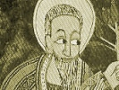

  
[Intangible Textual Heritage](../../index)  [Christianity](../index) 
[Africa](../../afr/index)  [Index](index)  [Previous](kn018) 
[Next](kn020) 

------------------------------------------------------------------------

  
*The Kebra Nagast*, by E.A. Wallis Budge, \[1932\], at Intangible
Textual Heritage

------------------------------------------------------------------------

### 19. *How this Book came to be found*

   And DĔMÂTĔYÔS (the Patriarch TIMOTHEUS (?) who sat from 511 to 517), the
Archbishop of RÔM (i.e., CONSTANTINOPLE, BYZANTIUM), said, "I have found in the Church of
\[Saint\] SOPHIA among the books and the
royal treasures a manuscript \[which stated\] that the whole kingdom of
the world \[belonged\] to the Emperor of RÔM
and the Emperor of ETHIOPIA."

------------------------------------------------------------------------

[Next: 20. Concerning the Division of the Earth](kn020)

