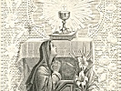
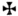

  
[Intangible Textual Heritage](../../index)  [Christianity](../index) 
[Index](index)  [Previous](ord00) 

------------------------------------------------------------------------

  
The Ordinary of the Mass (Latin/English), at Intangible Textual Heritage

------------------------------------------------------------------------

p. 464

 

THE CANON OF THE MASS

|                                                                                                                                                                                                                                                                                                                                                                                                                                                                                                                                                                                                                                                                                          |     |                                                                                                                                                                                                                                                                                                                                                                                                                                                                                                                                                                                                                                                                                                                                                                                                                                              |
|------------------------------------------------------------------------------------------------------------------------------------------------------------------------------------------------------------------------------------------------------------------------------------------------------------------------------------------------------------------------------------------------------------------------------------------------------------------------------------------------------------------------------------------------------------------------------------------------------------------------------------------------------------------------------------------|-----|----------------------------------------------------------------------------------------------------------------------------------------------------------------------------------------------------------------------------------------------------------------------------------------------------------------------------------------------------------------------------------------------------------------------------------------------------------------------------------------------------------------------------------------------------------------------------------------------------------------------------------------------------------------------------------------------------------------------------------------------------------------------------------------------------------------------------------------------|
| Te ígitur, clementíssime Pater, per Jesum Christum Fílium tuum Dóminum nostrum súpplices rogámus ac pétimus (*osculatur* *altare*) uti accépta hábeas, et benedícas (*jungit* *manus, deinde signat ter super oblata*), hæc  dona, hæc  múnera, hæc  sancta sacrifícia illibáta (*extensis* *manibus prosequitur*): in primis quæ tibi offérimus pro Ecclésia tua sancta cathólica: quam pacificáre, custodíre, adunáre, et régere dignéris toto orbe terrárum, una cum famulo tuo Papa nostro *N*. et Antístite nostro *N*. et ómnibus orthodóxis, atque cathólicæ et apostólicæ fídei cultóribus. |     | Wherefore, O most merciful Father, we humbly pray and beseech thee, through Jesus Christ thy Son, our Lord (*he kisses the altar*), that thou p. 465 wouldst vouchsafe to receive and bless (*he joins his hands together, and then makes the sign of the cross thrice over the offerings*) these  gifts, these  offerings, this  holy and unblemished sacrifice (he extends his hands and continues), which in the first place we offer thee for thy holy Catholic Church, that it may please thee to grant her peace: as also to protect, unite, and govern her throughout the world, together with thy servant *N*., our Pope *N*., our bishop, as also all orthodox believers who keep the catholic and apostolic faith. |

*The Commemoration for the living*.

|                                                                                            |     |                                                                                                 |
|--------------------------------------------------------------------------------------------|-----|-------------------------------------------------------------------------------------------------|
| Meménto, Dómine, famulórum famularúmque tuárum *N*. et *N*. |     | Be mindful, O Lord, of thy servants and handmaids, *N*. and *N*. |

*He joins his hands, prays a little while for those he wishes to pray
for, then with his hands stretched out he continues:* 

|                                                                                                                                                                                                                                                                                                                                      |     |                                                                                                                                                                                                                                                                                                                                                        |
|--------------------------------------------------------------------------------------------------------------------------------------------------------------------------------------------------------------------------------------------------------------------------------------------------------------------------------------|-----|--------------------------------------------------------------------------------------------------------------------------------------------------------------------------------------------------------------------------------------------------------------------------------------------------------------------------------------------------------|
| Et ómnium circumstántium, quorum tibi fides cógnita est, et nota devótio: pro quibus tibi offérimus, vel qui tibi ófferunt hoc sacrifícium laudis, pro se, suísque ómnibus, pro redemptióne animárum suárum, pro spe salútis et incolumitátis suæ; tibíque reddunt vota sua ætérno Deo, vivo et vero. |     | And of all here present, whose faith and devotion are known unto thee; for whom we offer, or who offer up to thee, this sacrifice of praise for themselves and theirs, for the redeeming of their souls, for the hope of their safety and salvation, and who pay their vows to thee, the eternal, living, and true God. |

 

<table data-border="0" width="100%">
<colgroup>
<col style="width: 33%" />
<col style="width: 33%" />
<col style="width: 33%" />
</colgroup>
<tbody>
<tr class="odd">
<td data-valign="top" width="48%">
<em>Infra actionem</em>.

Communicántes, et memóriam venerántes, in primis gloriósæ semper Vírginis Maríæ, genitrícis Dei et Dómini nostri Jesu Christi: sed et beatórum Apostolórum ac Mártyrum tuórum, Petri et Pauli, Andréæ, Jacóbi, Joánnis, Thomæ, Jacóbi, Philíppi, Bartholomæi, Matthæi, Simónis et Thaddæi, Cleti, Cleméntis, Xysti, Cornélii, Cypriáni, Lauréntii, Chrysógoni, Joánnis et Pauli, Cosmæ et Damiáni et ómnium sanctórum tuórum: quorum méritis precibúsque concédas, ut in ómnibus protectiónis tuæ muniámur auxílio. (<em>Jungit</em> <em>manus</em>.) Per eúmdem Christum Dóminum nostrum. Amen.
</td>
<td data-valign="top" width="2%">
 
</td>
<td data-valign="top" width="48%">
<em>Within the action</em>.

Communicating, and reverencing the memory first of the glorious Mary, ever a virgin, Mother of our God and Lord Jesus Christ; likewise of thy blessed apostles and martyrs, Peter and Paul, Andrew, James, John, Thomas, James, Philip, Bartholomew, p. 466 Matthew, Simon and Thaddeus; of Linus, Cletus, Clement, Xystus, Cornelius, Cyprian, Lawrence, Chrysogonus, john and Paul, Cosmas and Damian, and of all thy saints; by whose merits and prayers grant that in all things we may be guarded by thy protecting help. (<em>He joins his hands together</em>.) Through the same Christ our Lord. Amen.
</td>
</tr>
</tbody>
</table>

*With his hands spread over the offerings, he says:* 

<table data-border="0" width="100%">
<colgroup>
<col style="width: 33%" />
<col style="width: 33%" />
<col style="width: 33%" />
</colgroup>
<tbody>
<tr class="odd">
<td data-valign="top" width="48%">
Hanc ígitur oblatiónem servitútis nostræ, sed et cunctæ famíliæ tuæ, quæsumus Dómine, ut placátus accípias, diésque nostros in tua pace dispónas, atque ab ætérna damnatióne nos éripi, et in electórum tuórum júbeas grege numerári. (<em>Jungit</em> <em>manus</em>.) Per Christum Dóminum nostrum. Amen.

Quam oblatiónem tu, Deus, in ómnibus, quæsumus,
</td>
<td data-valign="top" width="2%">
 
</td>
<td data-valign="top" width="48%">
We therefore beseech thee, O Lord, to be appeased, and to receive this offering of our bounden duty, as also of thy whole household; order our days in thy peace; grant that we be rescued from eternal damnation and counted within the fold of thine elect. (<em>He joins his hands together</em>.) Through Christ our Lord. Amen.

Which offering do thou, O God, vouchsafe in all things.
</td>
</tr>
</tbody>
</table>

*He makes the sign of the cross three times over the offerings*.

|                                                                                                                                     |     |                                                                                                                         |
|-------------------------------------------------------------------------------------------------------------------------------------|-----|-------------------------------------------------------------------------------------------------------------------------|
| benedíctam, adscríptam, ratam, rationábilem, acceptabilémque fácere dignéris: |     | to bless , consecrate , approve , make reasonable and acceptable: |

*He makes the sign of the cross once over the host and once over the
chalice*.

<table data-border="0" width="100%">
<colgroup>
<col style="width: 33%" />
<col style="width: 33%" />
<col style="width: 33%" />
</colgroup>
<tbody>
<tr class="odd">
<td data-valign="top" width="48%">
ut nobis Corpus et Sanguis fiat dilectíssimi Fílii tui Dómini nostri Jesu Christi.

Qui prídie quam paterétur (<em>accipit</em> <em>hostiam</em>), accépit panem in sanctas ac venerábiles manus suas (<em>elevat</em> <em>oculos ad cœlum</em>), et elevátis óculis in cœlum, ad te Deum Patrem suum omnipoténtem, tibi grátias agens,
</td>
<td data-valign="top" width="2%">
 
</td>
<td data-valign="top" width="48%">
that it may become for us the Body  and  Blood of thy most beloved Son our Lord Jesus Christ.

Who the day before he suffered took bread (<em>he takes the host</em>) into his holy and venerable hands (<em>he raises</em> p. 467 <em>his eyes to heaven</em>), and with his eyes lifted up to heaven, unto thee, God, his almighty Father, giving thanks to thee,
</td>
</tr>
</tbody>
</table>

*He makes the sign of the cross over the host*.

|                                                                                                             |     |                                                                                                       |
|-------------------------------------------------------------------------------------------------------------|-----|-------------------------------------------------------------------------------------------------------|
| benedíxit, fregit, dedítque discípulis suis, dicens: Accípite, et manducáte ex hoc omnes. |     | he blessed , brake, and gave to his disciples, saying: Take and eat ye all of this, |

*Holding the host between the first fingers and thumbs of both hands, he
says the words of consecration, silently with clearness and attention,
over the host, and at the same time over all the other hosts, if several
are to be consecrated*.

|                           |     |                      |
|---------------------------|-----|----------------------|
| Hoc est enim Corpus meum. |     | For this is my Body. |

*As soon as the words of consecration have been said, he kneels and
adores the consecrated host. He rises, shows it to the people, puts it
on the corporal, and again adores. Then, uncovering the chalice, he
says:* 

|                                   |     |                                      |
|-----------------------------------|-----|--------------------------------------|
| Símili modo postquam cœnátum est, |     | In like manner, after he had supped, |

*He takes the chalice with both hands*.

|                                                                                                    |     |                                                                                                  |
|----------------------------------------------------------------------------------------------------|-----|--------------------------------------------------------------------------------------------------|
| accípiens et hunc præclárum Cálicem in sanctas ac venerábiles manus suas, item tibi grátias agens, |     | taking also this excellent chalice into his holy and adorable hands; also giving thanks to thee, |

*Holding the chalice with his left hand, he makes the sign of the cross
over it with his right*.

|                                                                                                 |     |                                                                                                      |
|-------------------------------------------------------------------------------------------------|-----|------------------------------------------------------------------------------------------------------|
| benedíxit, dedítque discípulis suis, dicens: Accípite, et bíbite ex eo omnes: |     | he blessed , and gave it to his disciples, saying: Take, and drink ye all of this; |

*He utters the words of consecration over the chalice silently,
attentively, carefully, and without pausing, holding it slightly
raised*.

|                                                                                                                                                 |     |                                                                                                                                                                   |
|-------------------------------------------------------------------------------------------------------------------------------------------------|-----|-------------------------------------------------------------------------------------------------------------------------------------------------------------------|
| Hic est enim Calix Sánguinis mei, novi et ætérni testaménti; mystérium fidei: qui pro vobis et pro multis effundétur in remissiónem peccatórum. |     | For this is the Chalice of my Blood, of the new and eternal testament; the mystery of faith: which shall be shed for you and for many unto the remission of sins. |

*As soon as the words of consecration have been said, he puts the
chalice on the corporal, and says silently:* 

|                                                        |     |                                                                         |
|--------------------------------------------------------|-----|-------------------------------------------------------------------------|
| Hæc quotiescúmque fecéritis, in mei memóriam faciétis. |     | As often as ye shall do these things, ye shall do them in memory of me. |

p. 468

*He kneels and adores; then rises, shows it to the people, puts it down,
covers it, and again adores. Then holding his hands apart, he says:* 

|                                                                                                                                                                                                                                                                    |     |                                                                                                                                                                                                                                                                                                |
|--------------------------------------------------------------------------------------------------------------------------------------------------------------------------------------------------------------------------------------------------------------------|-----|------------------------------------------------------------------------------------------------------------------------------------------------------------------------------------------------------------------------------------------------------------------------------------------------|
| Unde et mémores, Dómine, nos servi tui, sed et plebs tua sancta, ejúsdem Christi Fílii tui Dómini nostri, tam beatæ passiónis, necnon et ab ínferis resurrectiónis, sed et in cœlos gloriósæ ascensiónis: offérimus præcláræ majestáti tuæ de tuis donis ac datis, |     | Wherefore, O Lord, we thy servants, as also thy holy people, calling to mind the blessed passion of the same Christ thy Son our Lord, and also his rising up from hell, and his glorious ascension into heaven, do offer unto thy most excellent majesty, of thine own gifts bestowed upon us, |

*He joins his hands and makes the sign of the cross three times over the
host and chalice together*.

|                                                                                                               |     |                                                                                                           |
|---------------------------------------------------------------------------------------------------------------|-----|-----------------------------------------------------------------------------------------------------------|
| hóstiam  puram, hóstiam  sanctam, hóstiam  immaculátam, |     | a pure  victim, a holy  victim, a spotless  victim, |

*He makes the sign of the cross once over the host and once over the
chalice*.

|                                                                                               |     |                                                                                                                 |
|-----------------------------------------------------------------------------------------------|-----|-----------------------------------------------------------------------------------------------------------------|
| Panem  sanctum vitæ ætérnæ, et Cálicem  salútis perpétuæ. |     | the holy  Bread of eternal life, and the Chalice  of everlasting salvation. |

*He continues with his hands stretched out:* 

|                                                                                                                                                                                                                                                                                                                   |     |                                                                                                                                                                                                                                                                                                                                |
|-------------------------------------------------------------------------------------------------------------------------------------------------------------------------------------------------------------------------------------------------------------------------------------------------------------------|-----|--------------------------------------------------------------------------------------------------------------------------------------------------------------------------------------------------------------------------------------------------------------------------------------------------------------------------------|
| Supra quæ propítio ac seréno vultu respícere dignéris: et accépta habére, sícuti accépta habére dignátus es múnera púeri tui justi Abel, et sacrifícium patriárchæ nostri Ábrahæ, et quod tibi óbtulit summus sacérdos tuus Melchísedech sanctum sacrifícium, immaculátam hóstiam. |     | Upon which do thou vouchsafe to look with a propitious and serene countenance, and to accept them, as thou wert graciously pleased to accept the gifts of thy just servant Abel, and the sacrifice of our patriarch Abraham, and that which thy high priest Melchisedech offered to thee, a holy sacrifice, a spotless victim. |

*Bowing low with his hands joined together and then laid on the altar,
he says:* 

|                                                                                                                                                                                                                                                                            |     |                                                                                                                                                                                                                                                                            |
|----------------------------------------------------------------------------------------------------------------------------------------------------------------------------------------------------------------------------------------------------------------------------|-----|----------------------------------------------------------------------------------------------------------------------------------------------------------------------------------------------------------------------------------------------------------------------------|
| Súpplices te rogámus, omnípotens Deus: jube hæc perférri per manus sancti Ángeli tui in sublíme altáre tuum, in conspéctu divínæ majestátis tuæ: ut quotquot (*osculatur* *altare*), ex hac altáris participatióne, sacrosánctum Fílii tui, |     | We most humbly beseech thee, almighty God, to command that these things be borne by the hands of thy holy angel to thine altar On high, in the sight of thy divine majesty, that as many of us *(he kisses the altar*) as, at this altar, shall partake of and receive the |

p. 469

*He joins his hands together and makes the sign of the cross over the
host and once over the chalice*.

|                                                                                                                                                                                                         |     |                                                                                                                                                                                                                                                        |
|---------------------------------------------------------------------------------------------------------------------------------------------------------------------------------------------------------|-----|--------------------------------------------------------------------------------------------------------------------------------------------------------------------------------------------------------------------------------------------------------|
| Corpus et Sánguinem sumpsérimus (*seipsum* *signat*), omni benedictióne cœlésti, et grátia repleámur (*jungit* *manus*). Per eúndem Christum Dóminum nostrum. Amen. |     | most holy Body  and  Blood of thy Son (h*e makes the sign of the cross on himself*), may be filled with every heavenly blessing and grace (*he joins his hands together*). Through the same Christ our Lord. Amen. |

*The Commemoration for the dead*.

|                                                                                                                                                                    |     |                                                                                                                                                   |
|--------------------------------------------------------------------------------------------------------------------------------------------------------------------|-----|---------------------------------------------------------------------------------------------------------------------------------------------------|
| Meménto étiam, Dómine, famulórum famularúmque tuárum *N*. et *N*. qui nos præcessérunt cum signo fídei, et dórmiunt in somno pacis. |     | Be mindful, O Lord, of thy servants and handmaids *N*. and *N*., who are gone before us, with the sign of faith, and sleep in the sleep of peace. |

*He joins his hands, prays a little while for those dead whom he means
to pray for, then with his hands stretched out, continues:* 

|                                                                                                                 |     |                                                                                                                    |
|-----------------------------------------------------------------------------------------------------------------|-----|--------------------------------------------------------------------------------------------------------------------|
| Ipsis, Dómine, et ómnibus in Christo quiescéntibus, locum refrigérii, lucis et pacis, ut indúlgeas, deprecámur. |     | To these, O Lord, and to all that rest in Christ, we beseech thee, grant a place of refreshment, light, and peace. |

*He joins his hands together, and bows his head*.

|                                            |     |                                         |
|--------------------------------------------|-----|-----------------------------------------|
| Per eúmdem Christum Dóminum nostrum. Amen. |     | Through the same Christ our Lord. Amen. |

*He strikes his breast with his right hand, and slightly raising his
voice, says:* 

|                                                                                                                                                                                                                                                                                                                                                                                                                                                                                                                                                                                                                     |     |                                                                                                                                                                                                                                                                                                                                                                                                                                                                                                                                                                                                                                                         |
|---------------------------------------------------------------------------------------------------------------------------------------------------------------------------------------------------------------------------------------------------------------------------------------------------------------------------------------------------------------------------------------------------------------------------------------------------------------------------------------------------------------------------------------------------------------------------------------------------------------------|-----|---------------------------------------------------------------------------------------------------------------------------------------------------------------------------------------------------------------------------------------------------------------------------------------------------------------------------------------------------------------------------------------------------------------------------------------------------------------------------------------------------------------------------------------------------------------------------------------------------------------------------------------------------------|
| Nobis quoque peccatóribus, fámulis tuis, de multitúdine miseratiónum tuárum sperántibus, partem áliquam et societátem donáre dignéris, cum tuis sanctis Apóstolis et Martyribus: cum Joánne, Stéphano, Mathía, Bárnaba, Ignátio, Alexándro, Marcellíno, Petro, Felicitáte, Perpétua, Ágatha, Lúcia, Agnéte, Cæcília, Anastásia, et ómnibus sanctis tuis; intra quorum nos consórtium, non æstimátor mériti, sed véniæ, quæsumus, largítor admítte. Per Christum Dóminum nostrum. Per quem hæc ómnia, Dómine, semper bona creas, sanctíficas, vivíficas, benedícis, et præstas nobis. |     | To us sinners, also, thy servants, hoping in the multitude of thy mercies, vouchsafe to grant some part and fellowship with thy holy apostles and martyrs: with John, Stephen, Matthias, Barnabas, Ignatius, Alexander, Marcellinus, Peter, Felicity, Perpetua, Agatha, Lucy, Agnes, Cecily, Anastasia, and with all thy saints, into whose company we pray thee admit us, not considering our merit, but of thine own free pardon. Through Christ our Lord; p. 470 through whom, O Lord, thou dost create, hallow, quicken, and bless these thine ever-bountiful gifts and give them, to us. |

*He uncovers the chalice, kneels, takes the blessed sacrament in his
right hand, and holding the chalice in his left, makes the sign of the
cross three times over it from lip to lip, saying:*

|                                                                                           |     |                                                                                            |
|-------------------------------------------------------------------------------------------|-----|--------------------------------------------------------------------------------------------|
| Per ipsum, et cum ipso, et in ipso, |     | By  him, and with  him, and in  him, |

*He makes the sign of the cross twice between the chalice and his
breast*.

|                                                                                                   |     |                                                                                                            |
|---------------------------------------------------------------------------------------------------|-----|------------------------------------------------------------------------------------------------------------|
| est tibi Deo Patri  omnipoténti, in unitáte Spíritus  sancti, |     | is to thee, God the Father  almighty, in the unity of the Holy  Ghost, |

*Lifting up the chalice a little with the host, he says:*

|                        |     |                       |
|------------------------|-----|-----------------------|
| omnis honor et glória. |     | all honour and glory. |

*He puts back the host, covers the chalice, kneels, rises, and sings or
reads:* 

<table data-border="0" width="100%">
<colgroup>
<col style="width: 33%" />
<col style="width: 33%" />
<col style="width: 33%" />
</colgroup>
<tbody>
<tr class="odd">
<td data-valign="top" width="48%">
Per ómnia sæcula sæculórum. R. Amen.

Orémus. Præcéptis salutáribus móniti, et divína institutióne formáti, audémus dícere:
</td>
<td data-valign="top" width="2%">
 
</td>
<td data-valign="top" width="48%">
For ever and ever. R. Amen.

Let us pray. Taught by the precepts of salvation, and following the divine commandment, we make bold to say:
</td>
</tr>
</tbody>
</table>

*He stretches out his hands*.

<table data-border="0" width="100%">
<colgroup>
<col style="width: 33%" />
<col style="width: 33%" />
<col style="width: 33%" />
</colgroup>
<tbody>
<tr class="odd">
<td data-valign="top" width="48%">
Pater noster, qui es in cœlis, sanctificétur nomen tuum: advéniat regnum tuum: fiat volúntas tua, sicut in cœlo et in terra panem nostrum quotidiánum da nobis hódie; et dímitte nobis débita nostra, sicut et nos dimíttimus debitóribus nostris: et ne nos indúcas in tentatiónem.

R. Sed líbera nos a malo.
</td>
<td data-valign="top" width="2%">
 
</td>
<td data-valign="top" width="48%">
Our Father, who art in heaven, hallowed be thy name: thy kingdom come; thy will be done on earth as it is in heaven. Give us this day our daily bread: and forgive us our trespasses, as we forgive them that trespass against us. And lead us not into temptation.

R. But deliver us from evil.
</td>
</tr>
</tbody>
</table>

*The priest says,* Amen*. He takes the paten between his first and
middle finger, and says:* 

p. 471

|                                                                                                                                                                                                                                      |     |                                                                                                                                                                                                                                                           |
|--------------------------------------------------------------------------------------------------------------------------------------------------------------------------------------------------------------------------------------|-----|-----------------------------------------------------------------------------------------------------------------------------------------------------------------------------------------------------------------------------------------------------------|
| Líbera nos, quæsumus Dómine, ab ómnibus malis prætéritis, præséntibus, et futúris, et intercedénte beáta et gloriósa semper Vírgine Dei genitríce María, cum beátis Apóstolis tuis Petro et Paulo, atque Andréa, et ómnibus sanctis, |     | Deliver us, we beseech thee, O Lord, from all evils, past, present, and to come; and by the intercession of the blessed and glorious, Mary ever virgin, Mother of God, together with thy blessed apostles Peter and Paul, and Andrew, and all the saints, |

*He makes the sign of the cross with the paten from his forehead to his
breast and kisses it*.

|                                                                                                                                          |     |                                                                                                                                   |
|------------------------------------------------------------------------------------------------------------------------------------------|-----|-----------------------------------------------------------------------------------------------------------------------------------|
| da propítius pacem in diébus nostris: ut ope misericórdiæ tuæ adjúti, et a peccáto simus semper líberi, et ab omni perturbatióne secúri. |     | mercifully grant peace in our days: that through the help of thy mercy we may always be free from sin, and safe from all trouble. |

*He puts the paten under the host, uncovers the chalice, kneels, rises,
takes the host and breaks it in half over the chalice, saying:*

|                                                        |     |                                                 |
|--------------------------------------------------------|-----|-------------------------------------------------|
| Per eúmdem Dóminum nostrum Jesum Christum Fílium tuum, |     | Through the same Jesus Christ thy Son our Lord, |

*He puts the portion that is in his right hand on to the paten; he then
breaks off a small piece from the portion which is in his left hand,
saying:* 

|                                                            |     |                                                                            |
|------------------------------------------------------------|-----|----------------------------------------------------------------------------|
| qui tecum vivit et regnat in unitáte Spíritus sancti Deus. |     | who liveth and reigneth with thee in the unity of the Holy Ghost, one God. |

*He puts the other half with his left hand on to the paten, and holding
the particle over the chalice in his right hand, and the chalice with
his left, he says:* 

|                                      |     |                             |
|--------------------------------------|-----|-----------------------------|
| Per ómnia sæcula sæculórum. R. Amen. |     | For ever and ever. R. Amen. |

*He makes the sign of the cross three times over the chalice with the
particle of the host, saying:* 

<table data-border="0" width="100%">
<colgroup>
<col style="width: 33%" />
<col style="width: 33%" />
<col style="width: 33%" />
</colgroup>
<tbody>
<tr class="odd">
<td data-valign="top" width="48%">
Pax  Dómini sit  semper vobíscum.

R. Et cum spíritu tuo.
</td>
<td data-valign="top" width="2%">
 
</td>
<td data-valign="top" width="48%">
The peace of the Lord be  always with  you.

R. And with thy spirit.
</td>
</tr>
</tbody>
</table>

*He puts the particle into the chalice, saying silently:*

|                                                                                                                                 |     |                                                                                                                                      |
|---------------------------------------------------------------------------------------------------------------------------------|-----|--------------------------------------------------------------------------------------------------------------------------------------|
| Hæc commíxtio et consecrátio Córporis et Sánguinis Dómini nostri Jesu Christi, fiat accipiéntibus nobis in vitam ætérnam. Amen. |     | May this mingling and hallowing of the Body and Blood of our Lord Jesus Christ avail us that receive it unto life everlasting. Amen. |

p. 472

*He covers the chalice, kneels, rises, and bowing before the blessed
Sacrament, with his hands joined together and striking his breast three
times, says: *

<table data-border="0" width="100%">
<colgroup>
<col style="width: 33%" />
<col style="width: 33%" />
<col style="width: 33%" />
</colgroup>
<tbody>
<tr class="odd">
<td data-valign="top" width="48%">
Agnus Dei, qui tollis peccáta mundi, miserére nobis.

Agnus Dei, qui tollis peccáta mundi, miserére nobis.

Agnus Dei, qui tollis peccáta mundi, dona nobis pacem.
</td>
<td data-valign="top" width="2%">
 
</td>
<td data-valign="top" width="48%">
Lamb of God, who takest away the sins of the world, have mercy on us.

Lamb of God, who takest away the sins of the world, have mercy on us.

Lamb of God, who takest away the sins of the world, grant us peace.
</td>
</tr>
</tbody>
</table>

*At mass for the dead, instead of saying:* miserére nobis, *he says:*
dona eis réquiem, rest. *And the third time he adds*, sempitérnam,
everlasting.

*Then with his hands joined together above the altar he bows down and
says the following prayers:* 

|                                                                                                                                                                                                                                                                              |     |                                                                                                                                                                                                                                                                                               |
|------------------------------------------------------------------------------------------------------------------------------------------------------------------------------------------------------------------------------------------------------------------------------|-----|-----------------------------------------------------------------------------------------------------------------------------------------------------------------------------------------------------------------------------------------------------------------------------------------------|
| Dómine Jesu Christe, qui dixísti Apóstolis tuis: Pacem relínquo vobis, pacem meam do vobis: ne respícias peccáta mea, sed fidem Eccelésiæ tuæ: eámque secúndum voluntátem tuam pacificáre et coaduráre dignéris. Qui vivis et regnas Deus, per ómnia sæcula sæculórum. Amen. |     | O Lord Jesus Christ, who didst say to thy apostles, Peace I leave with you, my peace I give unto you; look not upon my sins, but upon the faith of thy Church; and vouchsafe to her that peace and unity which is agreeable to thy will; who livest and reignest God for ever and ever. Amen. |

*If the kiss of peace is to be given, the priest kisses the altar, and
giving the kiss of peace, says:* 

<table data-border="0" width="100%">
<colgroup>
<col style="width: 33%" />
<col style="width: 33%" />
<col style="width: 33%" />
</colgroup>
<tbody>
<tr class="odd">
<td data-valign="top" width="48%">
Pax tecum.

R. Et cum spíritu tuo.
</td>
<td data-valign="top" width="2%">
 
</td>
<td data-valign="top" width="48%">
Peace be with you.

R. And with thy spirit.
</td>
</tr>
</tbody>
</table>

*At masses for the dead the kiss of peace is not given, neither is the
above prayer said*.

<table data-border="0" width="100%">
<colgroup>
<col style="width: 33%" />
<col style="width: 33%" />
<col style="width: 33%" />
</colgroup>
<tbody>
<tr class="odd">
<td data-valign="top" width="48%">
Dómine Jesu Christe, Fili Dei vivi, qui ex voluntáte Patris, cooperánte Spíritu sancto, per mortem tuam mundum vivificásti: líbera me per hoc sacrosánctum Corpus et Sánguinem tuum, ab ómnibus iniquitátibus meis, et univérsis malis, et fac me tuis semper inhærére mandátis, et a te numquam separári permíttas. Qui cum eódem Deo Patre et Spíritu sancto vivis et regnas Deus in sæcula sæculórum. Amen.

Percéptio Córporis tui, Dómine Jesu Christe, quod ego indígnus súmere præsúmo, non mihi provéniat in judícium et condemnatiónem: sed pro tua pietáte prosit mihi ad tutaméntum mentis et córporis, et ad medélam percipiéndam. Qui vivis et regnas cum Deo Patre in unitáte Spíritus sancti Deus, per ómnia sæcula sæculórum. Amen.
</td>
<td data-valign="top" width="2%">
 
</td>
<td data-valign="top" width="48%">
O Lord Jesus Christ, Son of the living God, who, according to the will of thy Father, through the co-operation of the Holy Ghost, hast by thy death given life to the world, deliver me by this, thy most holy Body and Blood, from all my iniquities and from every evil; and make me always cleave to thy commandments, and never suffer p. 473 me to be separated from thee; who with the same God the Father and Holy Ghost livest and reignest God for ever and ever. Amen.

Let not the receiving of thy Body, O Lord Jesus Christ, which I, all unworthy presume to take, turn to my judgement and damnation: but through thy loving-kindness may it avail me for a safeguard and remedy, both of soul and body. Who with God the Father, in the unity of the Holy Ghost, livest and reignest God for ever and ever. Amen.
</td>
</tr>
</tbody>
</table>

*The priest kneels down, rises, and says:* 

|                                                                                   |     |                                                                                                     |
|-----------------------------------------------------------------------------------|-----|-----------------------------------------------------------------------------------------------------|
| Panem cœléstem accípiam, et nomen Dómini invocábo. |     | I will take the Bread of heaven, and call upon the name of the Lord. |

*Then, bowing a little, he takes both parts of the host with the thumb
and first finger of his left hand, and the paten between his first and
middle finger. He strikes his breast with his right hand, and, slightly
raising his voice, says three times reverently and humbly:* 

|                                                                                                                                 |     |                                                                                                                                             |
|---------------------------------------------------------------------------------------------------------------------------------|-----|---------------------------------------------------------------------------------------------------------------------------------------------|
| Dómine, non sum dignus, ut intres sub tectum meum: sed tantum dic verbo, et sanábitur ánima mea. |     | Lord, I am not worthy that thou shouldst enter under my roof; say but the word, and my soul shall be healed. |

*He makes the sign of the cross with the host in his right hand over the
paten, and says:*

|                                                                                                                |     |                                                                                                                    |
|----------------------------------------------------------------------------------------------------------------|-----|--------------------------------------------------------------------------------------------------------------------|
| Corpus Dómini nostri Jesu Christi custódiat ánimam meam in vitam ætérnam. Amen. |     | May the Body of our Lord Jesus Christ preserve my soul unto life everlasting. Amen. |

*He receives both portions of the host reverently, joins his hands
together, and remains for a little while quietly meditating on the most
holy Sacrament. Then he uncovers the chalice, kneels, gathers up the
crumbs, if there are any, and wipes the paten above the chalice, whilst
he says:* 

|                                                                                                                                                                                                       |     |                                                                                                                                                                                                                                                                                          |
|-------------------------------------------------------------------------------------------------------------------------------------------------------------------------------------------------------|-----|------------------------------------------------------------------------------------------------------------------------------------------------------------------------------------------------------------------------------------------------------------------------------------------|
| Quid retríbuam Dómino pro ómnibus, quæ retríbuit mihi? Cálicem salutáris accípiam, et nomen Dómini invocábo. Laudans invocábo Dóminum, et ab inimícis meis salvus ero. |     | What return shall I make to the Lord for all he hath given unto me? I will take the Chalice of salvation, p. 474 and call upon the name of the Lord. Praising I will call upon the Lord, and I shall be saved from my enemies. |

*He takes the chalice into his right hand, and making the sign of the
cross on himself with it, he says:* 

|                                                                                                                 |     |                                                                                                                 |
|-----------------------------------------------------------------------------------------------------------------|-----|-----------------------------------------------------------------------------------------------------------------|
| Sanguis Dómini nostri Jesu Christi custódiat ánimam meam in vitam ætérnam. Amen. |     | May the Blood of our Lord Jesus Christ keep my soul unto life everlasting, Amen. |

*He receives the precious blood with the particle. Then, if there are
any communicants, he should give them communion before purifying.
Afterwards he says:* 

|                                                                                                                                         |     |                                                                                                                                                                                           |
|-----------------------------------------------------------------------------------------------------------------------------------------|-----|-------------------------------------------------------------------------------------------------------------------------------------------------------------------------------------------|
| Quod ore súmpsimus, Dómine, pura mente capiámus; et de múnere temporáli fiat nobis remédium sempitérnum. |     | Grant, Lord, that what we have taken with our mouth we may receive with a pure mind; and that from a temporal gift it may become for us an eternal remedy. |

*Meanwhile he passes the chalice to the server, who pours into a little
wine, with which he cleanses his fingers; then he continues:* 

|                                                                                                                                                                                                                                                                |     |                                                                                                                                                                                                                                                                                        |
|----------------------------------------------------------------------------------------------------------------------------------------------------------------------------------------------------------------------------------------------------------------|-----|----------------------------------------------------------------------------------------------------------------------------------------------------------------------------------------------------------------------------------------------------------------------------------------|
| Corpus tuum, Dómine, quod sumpsi, et Sanguis quem potávi, adhæreat viscéribus meis: et præsta; ut in me non remáneat scélerum mácula, quem pura et sancta refecérunt sacraménta. Qui vivis et regnas in sæcula sæculórum. Amen. |     | May thy Body, O Lord, which I have received, and thy Blood which I have drunk, cleave to my bowels; and grant that no stain of sin may remain in me, whom thy pure and holy sacraments have refreshed; who livest and reignest world without end. Amen. |

*He washes his fingers, wipes them, and takes the ablution; he wipes his
mouth and the chalice, which he covers, and after folding up the
corporal, arranges it on the altar as before. Then he continues mass.
After the last Postcommunion the priest says:* 

<table data-border="0" width="100%">
<colgroup>
<col style="width: 33%" />
<col style="width: 33%" />
<col style="width: 33%" />
</colgroup>
<tbody>
<tr class="odd">
<td data-valign="top" width="48%">
Dóminus vobíscum.

R. Et cum spíritu tuo.
</td>
<td data-valign="top" width="2%">
 
</td>
<td data-valign="top" width="48%">
The Lord be with you.

R. And with thy spirit.
</td>
</tr>
</tbody>
</table>

*Then either:*

|                 |     |                        |
|-----------------|-----|------------------------|
| Ite, missa est. |     | Go, you are dismissed. |

*or, according to what mass is being said:*

<table data-border="0" width="100%">
<colgroup>
<col style="width: 33%" />
<col style="width: 33%" />
<col style="width: 33%" />
</colgroup>
<tbody>
<tr class="odd">
<td data-valign="top" width="48%">
Benedicámus Dómino.

R. Deo grátias.
</td>
<td data-valign="top" width="2%">
 
</td>
<td data-valign="top" width="48%">
Let us bless the Lord.

R. Thanks be to God.
</td>
</tr>
</tbody>
</table>

*At mass for the dead, he says:*

<table data-border="0" width="100%">
<colgroup>
<col style="width: 33%" />
<col style="width: 33%" />
<col style="width: 33%" />
</colgroup>
<tbody>
<tr class="odd">
<td data-valign="top" width="49%">
Requiéscant in pace.

R. Amen.
</td>
<td data-valign="top" width="2%">
 
</td>
<td data-valign="top" width="49%">
May they rest in peace.

R. Amen.
</td>
</tr>
</tbody>
</table>

p. 475

*After saying,* Ite missa est *or* Benedicámus Dómino*, the priest bows
down at the middle of the altar, and with his hands joined above it,
says:* 

|                                                                                                                                                                                                                                                                        |     |                                                                                                                                                                                                                                                                                                                         |
|------------------------------------------------------------------------------------------------------------------------------------------------------------------------------------------------------------------------------------------------------------------------|-----|-------------------------------------------------------------------------------------------------------------------------------------------------------------------------------------------------------------------------------------------------------------------------------------------------------------------------|
| Pláceat tibi, sancta Trínitas, obséquium servitútis meæ: et præsta; ut sacrifícium quod óculis tuæ majestátis indígnus óbtuli, tibi sit acceptábile, mihíque, et ómnibus pro quibus illud óbtuli, sit, te miseránte, propitiábile. Per Christum Dóminum nostrum. Amen. |     | May the homage of my service be pleasing to thee, O holy Trinity; and grant that the sacrifice which I, though unworthy, have offered in the sight of thy majesty, may be acceptable to thee: and through thy mercy win forgiveness for me and for all those for whom I have offered it. Through Christ our Lord. Amen. |

*Then he kisses the altar, and raising his eyes upward, stretching out,
lifting up, and joining his hands, bowing his head before the cross, he
says:* 

|                                |     |                             |
|--------------------------------|-----|-----------------------------|
| Benedícat vos omnípotens Deus, |     | May God almighty bless you, |

*and turning towards the people, he blesses them once only, even at high
mass, and continues:* 

|                                                                   |     |                                                             |
|-------------------------------------------------------------------|-----|-------------------------------------------------------------|
| Pater, et Fílius  et Spíritus sanctus. R. Amen. |     | Father, and Son and Holy  Ghost. R. Amen. |

*At a bishop's mass a triple blessing is given. At mass for the dead no
blessing is given*.

*Then at the Gospel corner, after saying* Dóminus vobíscum*, and*
Inítium *or* Sequéntia sancti Evangélii*, and making the sign of the
cross on the altar, or on the book and on himself as at the Gospel in
the mass, he reads the Gospel of St. John, as below, or another Gospel
as appointed*.

<table data-border="0" width="100%">
<colgroup>
<col style="width: 33%" />
<col style="width: 33%" />
<col style="width: 33%" />
</colgroup>
<tbody>
<tr class="odd">
<td data-valign="top" width="48%">
 Inítium sancti Evangélii secúndum Joánnem. R. Glória tibi, Dómine.

In princípio erat Verbum, et Verbum erat apud Deum, et Deus erat Verbum. Hoc erat in princípio apud Deum. Ómnia per ipsum facta sunt, et sine ipso factum est nihil quod factum est. In ipso vita erat, et vita erat lux hóminum, et lux in ténebris lucet, et ténebræ eam non comprehendérunt. Fuit homo missus a Deo, cui nomen erat Joánnes. Hic venit in testimónium, ut testimónium perhibéret de lúmine, ut omnes créderent per illum. Non erat ille lux, sed ut testimónium perhibéret de lúmine. Erat lux vera quæ illúminat omnem hóminem veniéntem in hunc mundum. In mundo erat, et mundus per ipsum factus est, et mundus eum non cognóvit. In própria venit, et sui eum non recepérunt; quotquot autem recepérunt eum, dedit eis potestátem fílios Dei fíeri; his qui credunt in nómine ejus, qui non ex sanguínibus, neque ex voluntáte carnis, neque ex voluntáte viri, sed ex Deo nati sunt. (<em>Hic genuflectitur</em>.) Et verbum caro factum est, et habitávit in nobis: et vídimus glóriam ejus, glóriam quasi Unigéniti a Patre, plenum grátiæ et veritátis.

R. Deo grátias.
</td>
<td data-valign="top" width="2%">
 
</td>
<td data-valign="top" width="48%">
 The beginning of the holy Gospel according to St. John. R. Glory be to thee, O Lord.

In the beginning was the Word, and the Word was with God, and the Word was God: the same was in the beginning with God. All things were made by him, and without him was made nothing that was made: in him was life, and the life was the light of men; and the light shineth in darkness, and the darkness did not comprehend p. 476 it. There was a man sent from God, whose name was John. This man came for a witness to give testimony of the light, that all men might believe through him. He was not the light, but was to give testimony of the light, that was the true light which enlighteneth every man that cometh into this world. He was in the world, and the world was made by him, and the world knew him not. He came unto his own, and his own received him not. But as many as received him, he gave them power to become the sons of God: to them that believe in his name, who are born not of blood, nor of the will of the flesh, nor of the will of man, but of God. And the Word was made flesh (<em>here the people kneel down</em>), and dwelt among us; and we saw his glory, the glory as it were of the only-begotten of the Father, full of grace and truth.

R. Thanks be to God.
</td>
</tr>
</tbody>
</table>

*While leaving the altar the priest says silently the antiphon* Trium
puerórum*, &c*.

p. 477

  [  
Click to enlarge](img/47700.jpg)

 
