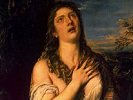

  
[Intangible Textual Heritage](../../index)  [Christianity](../index) 
[Index](index)  [Previous](lots222)  [Next](lots224) 

------------------------------------------------------------------------

[Buy this Book on
Kindle](https://www.amazon.com/exec/obidos/ASIN/B001CL82NS/internetsacredte)

------------------------------------------------------------------------

  
*Lives of the Saints*, by Alban Butler, Benziger Bros. ed. \[1894\], at
Intangible Textual Heritage

------------------------------------------------------------------------

### July 15.—ST. HENRY, Emperor.

HENRY, Duke of Bavaria, saw in a vision his guardian, St. Wolfgang,
pointing to the words "after six." This moved him to prepare for death,
and for six years he continued to watch and pray, when, at the end of
the sixth year, he found the warning verified in his election as
emperor. Thus trained in the fear of God, he ascended the throne with
but one thought—to reign for His greater glory. The pagan Slavs were
then despoiling the empire. Henry attacked them with a small force; but
angels and Saints were seen leading his troops, and the heathen fled in
despair. Poland and Bohemia, Moravia and Burgundy, were in turn annexed
to his kingdom, Pannonia and Hungary won to the Church. With the Faith
secured in Germany, Henry passed into Italy, drove out the Antipope
Gregory, brought Benedict VIII. back to Rome, and was crowned in St.
Peter's by that Pontiff, in 1014. It was Henry's custom, on arriving in
any town, to spend his first night in watching in some church dedicated
to our blessed Lady. As he was thus praying in St. Mary Major's, the
first night of his arrival in Rome, he "saw the Sovereign and Eternal
Priest Christ Jesus" enter to say Mass. Sts. Laurence and Vincent
assisted as deacon and sub-deacon. Saints innumerable filled the church,
and angels sang in

p. 251

the choir. After the Gospel, an angel was sent by Our Lady to give Henry
the book to kiss. Touching him lightly on the thigh, as the angel did to
Jacob, he said, "Accept this sign of God's love for your chastity and
justice;" and from that time the emperor always was lame. Like holy
David, Henry employed the fruits of his conquests in the service of the
temple. The forests and mines of the empire, the best that his treasury
could produce, were consecrated to the sanctuary. Stately cathedrals,
noble monasteries, churches innumerable, enlightened and sanctified the
once heathen lands. In 1022 Henry lay on his bed of death. He gave back
to her parents his wife, St. Cunegunda, "a virgin still, as a virgin he
had received her from Christ," and surrendered his own pure soul to God.

**Reflection**.—St. Henry deprived himself of many things to enrich the
house of God. We clothe ourselves in purple and fine linen, and leave
Jesus in poverty and neglect.

------------------------------------------------------------------------

[Next: 16. St. Simon Stock](lots224)

