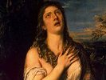

  
[Intangible Textual Heritage](../../index)  [Christianity](../index.md) 
[Index](index)  [Previous](lots233)  [Next](lots235.md) 

------------------------------------------------------------------------

[Buy this Book on
Kindle](https://www.amazon.com/exec/obidos/ASIN/B001CL82NS/internetsacredte.md)

------------------------------------------------------------------------

  
*Lives of the Saints*, by Alban Butler, Benziger Bros. ed. \[1894\], at
Intangible Textual Heritage

------------------------------------------------------------------------

### July 25.—ST. JAMES, Apostle.

AMONG the twelve, three were chosen as the familiar companions of our
blessed Lord, and of these James was one. He alone, with Peter and John,
was admitted to the house of Jairus when the dead maiden was raised to
life. They alone were taken up to the high mountain apart, and saw the
face of Jesus shining as the sun, and His garments white as snow; and
these three alone witnessed the fearful agony in Gethsemane. What was it
that won James a place among the favorite three? Faith, burning,
impetuous, and outspoken, but which needed. purifying before the "Son of
Thunder" could proclaim the gospel of peace. It was James who demanded
fire from heaven to consume the inhospitable Samaritans, and who sought
the place of honor by Christ in His Kingdom. Yet Our Lord, in rebuking
his presumption, prophesied his faithfulness to death. When St. James
was brought before King Herod Agrippa, his fearless confession of Jesus
crucified so moved the public prosecutor that he declared himself a
Christian on the spot. Accused and accuser were hurried off together to
execution, and on the road the latter begged pardon of the Saint. The
apostle had long since forgiven him, but hesitated for a moment whether
publicly to accept as a brother one still unbaptized. God quickly
recalled to him the Church's faith, that the blood of martyrdom supplies
for every sacrament, and, falling on his companion's neck, he embraced
him, with the words, "Peace be with thee!" Together then they knelt for
the sword, and together received the crown.

**Reflection**.—We must all desire a place in the kingdom of our Father;
but can we drink the chalice which He

p. 262

holds out to each? *Possumus*, we must say with SL. James—"We can"—but
only in the strength of Him Who has drunk it first for us.

------------------------------------------------------------------------

[Next: 26. St. Anne](lots235.md)

