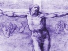

  
[Intangible Textual Heritage](../../index)  [Christianity](../index) 
[Index](index)  [Previous](mos00)  [Next](mos02) 

------------------------------------------------------------------------

[Buy this Book at
Amazon.com](https://www.amazon.com/exec/obidos/ASIN/B002AMUDEE/internetsacredte)

------------------------------------------------------------------------

  
*The Man of Sorrows*, by John Nelson Darby, \[n.d. (prior to 1882)\], at
Intangible Textual Heritage

------------------------------------------------------------------------

------------------------------------------------------------------------

p. 2

### EVERY CHRISTIAN'S LIBRARY

### OR, THE BIBLE LOVER'S BOOKSHELF.

These are advertisements from original book. They have been included for
the sake of completeness. This page has been moved in this text after
the title page.

**1/3**, or 30 cts., each net; **1/6**, or 36 cts., post free.

**Typical Foreshadowings in Genesis**. Wm. Lincoln, London. God Spoke
all these Words. Dr. Brookes.

**How and When do we Become Children of God?** Answered be 50 Accredited
Witnesses.

**Satan and the Satanic System**. L. S. Chafer.

**Aids to Believers**. Collected Writings of Dr. C. J. Davis.

**Handfuls of Help**. 300 Original Bible Studies. E. A. Hewitt.

**Always Abounding**. George Brealey, of the Blackdown Hills.

**God's Gospel and God's Righteousness**. Loyal and Logical Exposition
of Romans I. to V. Philip Mauro.

**God's Gift and Our Response**. Continuation of Exposition, Romans VI.
to VIII. Philip Mauro.

**The Charter of the Church**. Volume I. Exposition of 1 Corinthians I.
to VIII. J. R. Caldwell.

**The Charter of the Church**. Volume II. Exposition of 1 Corinthians
IX. to XVI. J. R. Caldwell.

**Twelve Baskets Full**. 640 Original Bible Outlines for Speakers,
Students, Missionaries, &c. Hy. Pickering.

**Pictures In the Acts**; or, The Unfinished Work of Jesus. Dr.
Anderson-Berry.

**Did Jesus Rise?** The Vital Fact of Christianity. Dr. Brookes.

**Abundant Grace**—Salvation, Sanctification, Service. Dr. W. P. Mackay.
Companion to "Grace and Truth." Genesis in the Light of the New
Testament. F. W. Grant, Editor of "Numerical Bible," &c.

**The Knowledge of God**. Its Meaning and its Power. Dr. A. T.
Schofield, Harley Street, London.

**The Gospel and its Ministry**. A Handbook of Evangelical Truth. Sir
Robert Anderson, K.C.B. LL.D.

**The Characteristic Differences of the Four Gospels**. By Andrew Jukes.

**The Law of the Offerings**. Andrew Jukes.

**The Shepherd and the Sheep**. Dr. Adolph Saphir.

**The Work of Christ**. Past, present, future. A. C. Gaebelein.

**Grace and Truth under 12 Aspects**. Dr. W. P. Mackay. With 8 Original
Drawings.

**The Brides of Scripture**. J. Denham Smith.

**Human Destiny**. Sir Robert Anderson, K.C.B., LL.D.

**"I Am Coming."** The Second Advent. Dr. Jas. H. Brookes. Keys to the
Word. Dr. A. T. Pierson.

**Prophecy Made Plain**. "Addresses on Prophecy." Dr. C. I. Scofield, of
New York.

**The Story of our English Bible**. Walter Scott.

**Eight Lectures on Prophecy**. W. Trotter.

**Rightly Dividing the Word of Truth**. Dr. C. I. Scofield.

**Choice Sayings**. 800 Gems of Thought. R. C. Chapman.

**Pilgrim's Progress**, with 100 Illustrations and Gospel Notes.

**The Parables of our Lord explained**. Thos. Newberry.

**The Life that Pleases God**. Dr. A. T. Schofield.

**The Footsteps of the Master**. Study of 1 Peter. A. Payne.

**The Progress of Doctrine in the New Testament**. Bampton Lectures. T.
D. Bernard, M.A.

**How God Answers Prayer**. George Muller. of Bristol.

**The Roman Empire In Prophecy**. W. E. Vine, M.A.

**The Epistles of John**. The Family Letters. Wm. Lincoln.

**The Silence of God**. Sir Robert Anderson, K.C.B.

**Heroes of the Faith in Modern Italy**. J. S. Anderson.

**The Man of Sorrows**. Notes on Luke. J. N. Darby.

HANDBOOK with full list of titles, &c., post free.

------------------------------------------------------------------------

p. 4

OFFICES AND AGENTS.

GLASGOW: PICKERING & INGLIS, 229 Bothwell Street.

 " JOHN MENZIES & Co., all their Branches and Bookstalls.

LONDON: ALFRED HOLNESS, 14 Paternoster ROW, E.C.,

 " S. W. PARTRIDGE & CO., and all Wholesale Houses.

MANCHESTER: JOHN HEYWOOD, Deansgate.

BIRMINGHAM: H. E. MASON, 315 Broad Street.

PLYMOUTH: J. E. BURT, Morley Villa, Fernleigh Road.

EXETER: W. C. ROGERS, 17 Cathedral Close.

BRISTOL: W. B. W. SARSFIELD, 78 Park Street.

BIRKENHEAD: J. E. Bares, 15 Laburnum Road, Oxton.

ILFRACOMBE: E. OSBORNE, 4 Portland Street.

CARDIFF: WILLIAM LEAR, 17 Royal Arcade.

DUBLIN: R. STEWARD, 10 D’Olier Street, and 2 Nassau Street.

BELFAST: R. M’CLAY, 44 Ann Street.

EDINBURGH: MARSHALL BROTHERS, Ltd., 99 George Street.

DUNDEE: R. H. LUNDIE, 35 Reform Street.

NEW YORK: GOSPEL PUBLISHING HOUSE, 692 Eighth Avenue.

TEXAS: J. T. DEAN, 2613 Pennsylvania Ave., Dallas.

CHARLOTTE, N.C.: A. F. COWLES, Gospel Tract Depot.

SWENGEL, PA.: I. C. HERENDEN, Bible Truth Depot.

ORILLIA, ONTARIO: S. W. BENNER, Bible and Tract Depot.

TORONTO: BIBLE AND TRACT DEPOT, 783 College Street.

 " UPPER CANADA TRACT SOCIETY, 2 Richmond Street, E.

BUENOS AIRES: W. C. K. TORRE, Caslila 5.

MELBOURNE: E. W. COLE, Book Arcade.

BRISBANE: W. R. SMITH & Co., Bible Repository, Albert Street.

DUNEDIN: H. J. BATES, Otago Bible House, 38 George Street.

AUCKLAND, N.Z.: H. L. THATCHER, Bible House, 135 Symonds St.

PALMERSTON NORTH: JAMES G. HARVEY, Main Street.

BANGALORE, INDIA: OFFICE OF "THE INDIAN CHRISTIAN."

CALCUTTA: "CHRISTIAN WITNESS" OFFICE.

ALESSANDRIA, ITALY: A. BUTTRAM, Va dells Vittoria N 3.

*And through mast Booksellers, Colporteurs, and Tract Depots*.

COPYRIGHT—PICKERING & INGLIS.

------------------------------------------------------------------------

[Next: How to Use](mos02)
