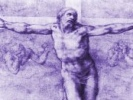

  
[Intangible Textual Heritage](../../index)  [Christianity](../index.md) 
[Index](index)  [Previous](mos02)  [Next](mos04.md) 

------------------------------------------------------------------------

[Buy this Book at
Amazon.com](https://www.amazon.com/exec/obidos/ASIN/B002AMUDEE/internetsacredte.md)

------------------------------------------------------------------------

  
*The Man of Sorrows*, by John Nelson Darby, \[n.d. (prior to 1882)\], at
Intangible Textual Heritage

------------------------------------------------------------------------

p. 6

# ISAIAH LIII.

WHO hath believed our report? and to whom is the arm of the Lord
revealed?

2\. For he shall grow up before Him as a tender plant, and as a root out
of a dry ground: He hath no form nor comeliness: and when we shall see
Him, there is no beauty that we should desire Him.

3\. He is despised and rejected of men; a man of sorrows, and acquainted
with grief: and we hid as it were our faces from Him; He was despised,
and we esteemed Him not.

A MAN OF SORROWS.

4\. Surely He hath borne our griefs, and carried our sorrows: yet we did
esteem Him stricken, smitten of God, and afflicted.

5\. But He was wounded for our transgressions, He was bruised for our
iniquities: the chastisement of our peace was upon Him; and with His
stripes we are healed.

------------------------------------------------------------------------

[Next: Index to Chapters](mos04.md)
