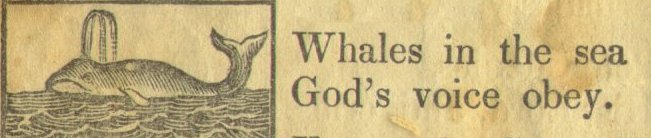

[Intangible Textual Heritage](../../index)  [Christianity](../index) 

------------------------------------------------------------------------

# The New England Primer

### \[1843\]

------------------------------------------------------------------------

[Contents](#contents)    [Start Reading](nep00)

------------------------------------------------------------------------

This was a standard reader in New England in the 18th and 19th
centuries. It was apparently used in both public and Sunday (religious)
schools. At that time children of all ages [studied in the same
classroom](nep01), so it has portions oriented towards younger and older
students.

Besides [instruction in the alphabet](nep06), the New England Primer
also served to indoctrinate young minds in the stern and [somewhat
morbid](nep12) Protestantism of that time and place. Depending on your
viewpoint, it is either yet another example of how religion has been
excised from the public schools in the United States, or a quaint sample
of what our forefathers considered acceptable as 'moral education'.

The New England Primer also has examples of religious intolerance,
specifically anti-Catholic and anti-Semitic statements, which reflect
then-contemporary attitudes.

This particular book went through a number of editions. This version was
scanned from an copy in the possession of my family which was published
in 1843. An earlier version, dated 1777, is also available
[here](1777/index).

--J.B. Hare.

------------------------------------------------------------------------

[Title Page](nep00)  
[Frontispiece](nep01)  
[Alphabet](nep02)  
[The Creed](nep03)  
[The Lord's Prayer](nep04)  
[The Ten Commandments](nep05)  
[Alphabet Poem](nep06)  
[An Alphabet of Lessons for Children](nep07)  
[Morning Prayer for a Child](nep08)  
[Evening Prayer for a Child](nep09)  
[Agur's Prayer](nep10)  
[Duty Of Children To Their Parents](nep11)  
[Uncertainty of Life](nep12)  
[On Life and Death](nep13)  
[The Infant's Grace Before and After Meat](nep14)  
[The Sum of the Ten Commandments](nep15)  
[Our Savior's Golden Rule](nep16)  
[Choice Sentences](nep17)  
[The Dutiful Child's Promise](nep18)  
[Instructive Questions and Answers](nep19)  
[Dr. Watts's Cradle Hymn](nep20)  
[Offices of Humanity](nep21)  
[The Burning of Mr. John Rogers](nep22)  
[Verses for Little Children](nep23)  
[The Shorter Catechism](nep24)  
[A Dialogue Between Christ, A Youth and the Devil](nep25)  
[Lessons for Children](nep26)  
