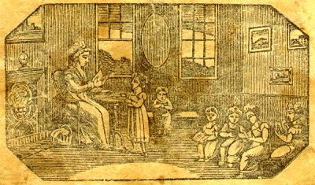

[Intangible Textual Heritage](../../index)  [Christianity](../index.md) 
[Index](index)  [Previous](nep00)  [Next](nep02.md) 

------------------------------------------------------------------------

p. 3

 

Children, like tender osiers, take the bow,  
And as they first are fashioned always grow;  
For what we learn in youth, to that alone,  
In age, we are by second nature prone

------------------------------------------------------------------------

[Next: Alphabet](nep02.md)
