[Intangible Textual Heritage](../../index)  [Christianity](../index.md) 
[Index](index)  [Previous](nep05)  [Next](nep07.md) 

------------------------------------------------------------------------

p. 11

<table data-cellspacing="0" data-border="0" data-cellpadding="9" width="708">
<colgroup>
<col style="width: 33%" />
<col style="width: 33%" />
<col style="width: 33%" />
</colgroup>
<tbody>
<tr class="odd">
<td colspan="2" width="50%" data-valign="TOP">
In Adam's fall 
We sinned all.
</td>
<td width="50%" data-valign="TOP">
 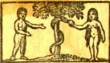
</td>
</tr>
<tr class="even">
<td width="50%" data-valign="TOP">
Thy life to mend, 
God's Book attend
</td>
<td colspan="2" width="50%" data-valign="TOP">
 
</td>
</tr>
<tr class="odd">
<td width="50%" data-valign="TOP">
The Cat doth play, 
And after slay.
</td>
<td colspan="2" width="50%" data-valign="TOP">
 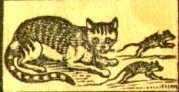
</td>
</tr>
<tr class="even">
<td width="50%" data-valign="TOP">
A Dog will bite 
A thief at night.
</td>
<td colspan="2" width="50%" data-valign="TOP">
 
</td>
</tr>
<tr class="odd">
<td width="50%" data-valign="TOP">
The Eagle's flight 
Is out of sight.
</td>
<td colspan="2" width="50%" data-valign="TOP">
 
</td>
</tr>
<tr class="even">
<td width="50%" data-valign="TOP">
The idle Fool 
Is whipped at school.
</td>
<td colspan="2" width="50%" data-valign="TOP">
 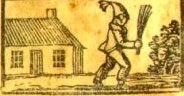
</td>
</tr>
</tbody>
</table>

A B C D E F

 

p. 12

<table data-cellspacing="0" data-border="0" data-cellpadding="9" width="798">
<colgroup>
<col style="width: 50%" />
<col style="width: 50%" />
</colgroup>
<tbody>
<tr class="odd">
<td width="50%" data-valign="TOP">
As runs the Glass. 
Man's life doth pass
</td>
<td width="50%" data-valign="TOP">
 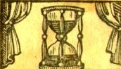
</td>
</tr>
<tr class="even">
<td width="50%" data-valign="TOP">
My book and Heart 
Shall never part.
</td>
<td width="50%" data-valign="TOP">
 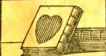
</td>
</tr>
<tr class="odd">
<td width="50%" data-valign="TOP">
Job feels the rod, 
Yet blesses God.
</td>
<td width="50%" data-valign="TOP">
 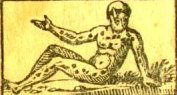
</td>
</tr>
<tr class="even">
<td width="50%" data-valign="TOP">
Proud Korah's troop 
Was swallowed up
</td>
<td width="50%" data-valign="TOP">
 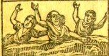
</td>
</tr>
<tr class="odd">
<td width="50%" data-valign="TOP">
The Lion bold 
The Lamb doth hold.
</td>
<td width="50%" data-valign="TOP">
 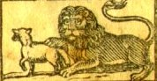
</td>
</tr>
<tr class="even">
<td width="50%" data-valign="TOP">
The Moon gives light 
In time of night.
</td>
<td width="50%" data-valign="TOP">
 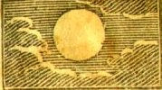
</td>
</tr>
</tbody>
</table>

G H I J K L M

 

p. 13

<table data-cellspacing="0" data-border="0" data-cellpadding="9" width="798">
<colgroup>
<col style="width: 50%" />
<col style="width: 50%" />
</colgroup>
<tbody>
<tr class="odd">
<td width="50%" data-valign="TOP">
Nightingales sing 
In time of spring.
</td>
<td width="50%" data-valign="TOP">
 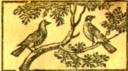
</td>
</tr>
<tr class="even">
<td width="50%" data-valign="TOP">
The royal Oak, it was the tree 
That saved his royal majesty.
</td>
<td width="50%" data-valign="TOP">
 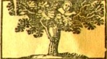
</td>
</tr>
<tr class="odd">
<td width="50%" data-valign="TOP">
Peter denies 
His Lord, and cries.
</td>
<td width="50%" data-valign="TOP">
 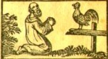
</td>
</tr>
<tr class="even">
<td width="50%" data-valign="TOP">
Queen Esther comes in royal state, 
To save the Jews from dismal fate.
</td>
<td width="50%" data-valign="TOP">
 
</td>
</tr>
<tr class="odd">
<td width="50%" data-valign="TOP">
Rachel doth mourn 
For her first born.
</td>
<td width="50%" data-valign="TOP">
 
</td>
</tr>
<tr class="even">
<td width="50%" data-valign="TOP">
Samuel anoints 
Whom God appoints
</td>
<td width="50%" data-valign="TOP">
 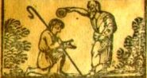
</td>
</tr>
</tbody>
</table>

N O P Q R S

p. 14

<table data-cellspacing="0" data-border="0" data-cellpadding="9" width="798">
<colgroup>
<col style="width: 50%" />
<col style="width: 50%" />
</colgroup>
<tbody>
<tr class="odd">
<td width="50%" data-valign="TOP">
Time cuts down all 
Both great and small
</td>
<td width="50%" data-valign="TOP">
 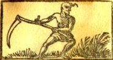
</td>
</tr>
<tr class="even">
<td width="50%" data-valign="TOP">
Uriah's beauteous wife 
Made David seek his life.
</td>
<td width="50%" data-valign="TOP">
 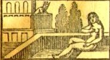
</td>
</tr>
<tr class="odd">
<td width="50%" data-valign="TOP">
Whales in the sea 
God's voice obey.
</td>
<td width="50%" data-valign="TOP">
 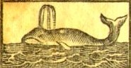
</td>
</tr>
<tr class="even">
<td width="50%" data-valign="TOP">
Xerxes the Great did die, 
And so must you and I.
</td>
<td width="50%" data-valign="TOP">
 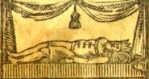
</td>
</tr>
<tr class="odd">
<td width="50%" data-valign="TOP">
Youth forward slips, 
Death soonest nips.
</td>
<td width="50%" data-valign="TOP">
 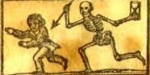
</td>
</tr>
<tr class="even">
<td width="50%" data-valign="TOP">
Zaccheus, he 
Did climb the tree, 
His Lord to see
</td>
<td width="50%" data-valign="TOP">
 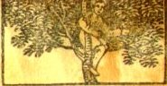
</td>
</tr>
</tbody>
</table>

T U V W X Y Z

------------------------------------------------------------------------

[Next: An Alphabet of Lessons for Children](nep07.md)
