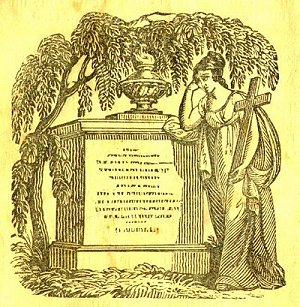

[Intangible Textual Heritage](../../index)  [Christianity](../index.md) 
[Index](index)  [Previous](nep11)  [Next](nep13.md) 

------------------------------------------------------------------------

p. 18

 

UNCERTAINTY OF LIFE.

I IN the burying place may see  
  Graves shorter there than I;  
From death's arrest no age is free  
  Young children, too, may die.

My God, may such an awful sight  
  Awakening be to me!  
O that by early grace I might  
  For death prepared be!

------------------------------------------------------------------------

[Next: On Life and Death](nep13.md)
