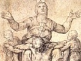

  
[Intangible Textual Heritage](../../index)  [Christianity](../index.md) 
[Index](index)  [Previous](pjc44)  [Next](pjc46.md) 

------------------------------------------------------------------------

[Buy this Book at
Amazon.com](https://www.amazon.com/exec/obidos/ASIN/B002A7WEK0/internetsacredte.md)

------------------------------------------------------------------------

  
*The Dolorous Passion of Our Lord Jesus Christ*, by Anne Catherine
Emmerich, \[1862\], at Intangible Textual Heritage

------------------------------------------------------------------------

# CHAPTER XXXI.

### The first Fall of Jesus.

THE street of which we have just spoken, after turning a little to the
left, became rather steep, as also wider, a subterranean aqueduct
proceeding from Mount Sion passed under it, and in its vicinity was a
hollow which was often filled with water and mud after rain, and a large
stone was placed in its centre to enable persons to pass over more
easily. When Jesus reached this spot, his strength was perfectly
exhausted; he was quite unable to move; and as the archers dragged and
pushed him without showing the slightest compassion, he fell quite down
against this

p. 237

stone, and the cross fell by his side. The cruel executioners were
obliged to stop, they abused and struck him unmercifully, but the whole
procession came to a standstill, which caused a degree of confusion.
Vainly did he hold out his hand for some one to assist him to rise:
'Ah!' he exclaimed, 'all will soon be over;' and he prayed for his
enemies. 'Lift him up,' said the Pharisees, I otherwise he will die in
our hands.' There were many women and children following the procession;
the former wept, and the latter were frightened. Jesus, however,
received support from above, and raised his head; but these cruel men,
far from endeavouring to alleviate his sufferings, put the crown of
thorns again on his head before they pulled him out of the mud, and no
sooner was he once more on his feet than they replaced the cross on his
back. The crown of thorns which encircled his head increased his pain
inexpressibly, and obliged him to bend on one side to give room for the
cross, which lay heavily on his shoulders.

------------------------------------------------------------------------

[Next: Chapter XXXII. The second Fall of Jesus](pjc46.md)
