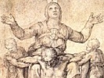

  
[Intangible Textual Heritage](../../index)  [Christianity](../index) 
[Index](index)  [Previous](pjc50)  [Next](pjc52) 

------------------------------------------------------------------------

[Buy this Book at
Amazon.com](https://www.amazon.com/exec/obidos/ASIN/B002A7WEK0/internetsacredte)

------------------------------------------------------------------------

  
*The Dolorous Passion of Our Lord Jesus Christ*, by Anne Catherine
Emmerich, \[1862\], at Intangible Textual Heritage

------------------------------------------------------------------------

# CHAPTER XXXVII.

### The Departure of Mary and the holy Women of Calvary.

ALTHOUGH the Blessed Virgin was carried away fainting after the sad
meeting with her Son loaded with his cross, yet she soon recovered
consciousness; for love, and the ardent desire of seeing him once more,
imparted to her a supernatural feeling of strength. Accompanied by her
companions she went to the house of Lazarus, which was at the bottom of
the town, and where Martha, Magdalen, and many holy women were already
assembled. All were sad and depressed, but Magdalen could not restrain
her tears and lamentations. They started from this

p. 249

house, about seventeen in number, to make the way of the cross, that is
to say, to follow every step Jesus had taken in this most painful
journey. Mary counted each footstep, and being interiorly enlightened,
pointed out to her companions those places which had been consecrated by
peculiar sufferings. Then did the sharp sword predicted by aged Simeon
impress for the first time in the heart of Mary that touching devotion
which has since been so constantly practised in the Church. Mary
imparted it to her companions, and they in their turn left it to future
generations,--a most precious gift indeed, bestowed by our Lord on his
beloved Mother, and which passed from her heart to the hearts of her
children through the revered voice of tradition.

When these holy women reached the house of Veronica they entered it,
because Pilate and his officers were at that moment passing through the
street, on their way home. They burst forth into unrestrained tears when
they beheld the countenance of Jesus imprinted on the veil, and they
returned thanks to God for the favour he had bestowed on his faithful
servant. They took the jar of aromatic wine which the Jews had prevented
Jesus from drinking, and set off together towards Golgotha. Their number
was considerably increased, for many pious men and women whom the
sufferings of our Lord had filled with pity had joined them, and they
ascended the west side of Calvary, as the declivity there was not so
great. The Mother of Jesus, accompanied by her niece, Mary (the daughter
of Cleophas), John, and Salome went quite up to the round platform; but
Martha, Mary of Heli, Veronica, Johanna, Chusa, Susanna, and Mary, the
mother of Mark, remained below with Magdalen, who could hardly support
herself. Lower down on the mountain there was a third group of holy
women, and there were a few scattered individuals between the three
groups, who carried messages from one to the other. The Pharisees on
horseback rode to and fro among the people, and the five entrances were
guarded by Roman soldiers. Mary kept her eyes fixed on the fatal spot,
and stood as if entranced,--if

p. 250

was indeed a sight calculated to appal and rend the heart of a mother.
There lay the terrible cross, the hammers, the ropes, the nails, and
alongside of these frightful instruments of torture stood the brutal
executioners, half drank, and almost without clothing, swearing and
blaspheming, whilst making their preparations. The sufferings of the
Blessed Virgin were greatly increased by her not being able to see her
Son; she knew that he was still alive, and she felt the most ardent
desire once more to behold him, while the thought of the torments he
still had to endure made her heart ready to burst with grief.

A little hail had been falling at times during the morning, but the sun
came out again after ten o'clock, and a thick red fog began to obscure
it towards twelve.

------------------------------------------------------------------------

[Next: Chapter XXXVIII. The Nailing of Jesus to the Cross](pjc52)
