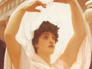

  
[Intangible Textual Heritage](../../index)  [Christianity](../index.md) 
[Gnosticism](../../gno/index)  [Index](index)  [Previous](ps018.md) 
[Next](ps020.md) 

------------------------------------------------------------------------

[Buy this Book at
Amazon.com](https://www.amazon.com/exec/obidos/ASIN/B002BA5HQY/internetsacredte.md)

------------------------------------------------------------------------

  
*Pistis Sophia*, by G.R.S. Mead, \[1921\], at Intangible Textual
Heritage

------------------------------------------------------------------------

### CHAPTER 15

Adamas and the tyrants fight against the
light."It came to pass then, when all those who are in the twelve
æons saw the great light which was about me, that they were all thrown
into agitation one over against the other, and ran hither and thither in
the æons. And all æons and all heavens and their whole ordering were
agitated one over against the other on \|**25**. account of the great fear which was on
them, for they knew not the mystery which had taken place. And Adamas,
the great Tyrant, and all the tyrants in all the æons began to fight in
vain against the light, and they knew not against whom they fought,
because they saw nothing but the overmastering light.

"It came to pass then, when they fought against the light, that they
were weakened all together one with another, were dashed down in the
æons and became as the inhabitants of the earth, dead and without breath
of life.

He taketh from them a third of their
power."And I took from all a third of their power, that they
should no more be active in their evil doings, and that, if the men who
are in the world, invoke them in their mysteries--those which the angels
who transgressed have brought down, that is their sorceries,--in order
that, therefore, if they invoke them in their evil doings, they may not
be able to accomplish them.

He changeth the motion of their
spheres."And the Fate and the sphere over which they rule, I have
changed and brought it to pass that they spend six months turned to the
left and accomplish their influences, and that six months they face to
the right and accomplish

p. 20

their influences. For by command of the First Commandment and by command
of the First Mystery \|**26**. Yew, the
Overseer of the Light, had set them facing the left at every time and
accomplishing their influences and their deeds.

------------------------------------------------------------------------

[Next: Chapter 16](ps020.md)
