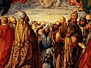

  
[Intangible Textual Heritage](../../index)  [Christianty](../index) 
[Index](index)  [Previous](ptp20)  [Next](ptp22) 

------------------------------------------------------------------------

[Buy this Book at
Amazon.com](https://www.amazon.com/exec/obidos/ASIN/B00295S01A/internetsacredte)

------------------------------------------------------------------------

  
*Pageant of the Popes*, by John Farrow, \[1942\], at Intangible Textual
Heritage

------------------------------------------------------------------------

p. 408 p. 409

### LIST OF POPES

There is uncertainty about the dates of some of the earlier Popes

|                                   |              |
|-----------------------------------|--------------|
| St. Peter                         | died 67      |
| St. Linus                         | 67-79        |
| St. Cletus                        | 79-89        |
| St. Clement I                     | 89-97        |
| St. Evaristus                     | 97-105       |
| St. Alexander I                   | 105-115      |
| St. Sixtus I                      | 115-125      |
| St. Telesphorus                   | 125-136      |
| St. Hyginus                       | 136-140      |
| St. Pius I                        | 140-155      |
| St. Anicetus                      | 155-166      |
| St. Soterus                       | 166-174      |
| St. Eleutherius                   | 174-189      |
| St. Victor I                      | 189-199      |
| St. Zephyrinus                    | 199-217      |
| St. Callistus I                   | 217-222      |
| St. Urban I                       | 222-230      |
| St. Pontian                       | 230-235      |
| St. Anterus                       | 235-236      |
| St. Fabian                        | 236-250      |
| St. Cornelius                     | 251-253      |
| St. Lucius I                      | 253-254      |
| St. Stephen I                     | 254-257      |
| St. Sixtus II                     | 257-258      |
| St. Dionysius                     | 259-268      |
| St. Felix I                       | 269-274      |
| St. Eutychian                     | 275-283      |
| St. Caius                         | 283-296      |
| St. Marcellinus                   | 296-304      |
| St. Marcellus I                   | 308-309      |
| St. Eusebius                      | 309-310      |
| St. Melchiades                    | 311-314      |
| St. Sylvester I                   | 314-335      |
| St. Mark                          | 336-337      |
| St. Julius I                      | 337-352      |
| St. Liberius                      | 352-366      |
| St. Damasus I                     | 366-384      |
| St. Siricius                      | 384-398      |
| St. Anastasius I                  | 398-401      |
| St. Innocent I                    | 401-417      |
| St. Zozimus                       | 417-418      |
| St. Boniface I                    | 419-422      |
| St. Celestine I                   | 422-432      |
| St. Sixtus III                    | 432-440      |
| St. Leo I (the Great)             | 440-461      |
| St. Hilary                        | 461-468      |
| St. Simplicius                    | 468-483      |
| St. Felix III                     | 483-492      |
| St. Gelasius I                    | 492-496      |
| St. Anastasius II                 | 496-498      |
| St. Symmachus                     | 498-514      |
| St. Hormisdas                     | 514-523      |
| St. John I                        | 523-526      |
| St. Felix IV                      | 526-530      |
| Boniface II                       | 530-532      |
| John II                           | 533-535      |
| St. Agapitus                      | 535-536      |
| St. Silverius                     | 536-537      |
| Vigilius                          | 537-555      |
| Pelagius I                        | 555-560      |
| John III                          | 561-574      |
| Benedict I                        | 575-578      |
| Pelagius II                       | 579-590      |
| p. 410 |              |
| St. Gregory I (the Great)         | 590-604      |
| Sabinian                          | 604-606      |
| Boniface III                      | 607          |
| St. Boniface IV                   | 608-615      |
| St. Deusdedit I                   | 615-619      |
| Boniface V                        | 619-625      |
| Honorius I                        | 625-638      |
| Severinus                         | 639-640      |
| John IV                           | 640-642      |
| Theodore I                        | 642-649      |
| St. Martin I                      | 649-655      |
| St. Eugene I                      | 655-657      |
| St. Vitalian                      | 657-672      |
| Adeodatus II                      | 672-676      |
| Donus I                           | 676-678      |
| St. Agatho                        | 678-682      |
| St. Leo II                        | 682-683      |
| St. Benedict II                   | 684-685      |
| John V                            | 685-686      |
| Conon                             | 686-687      |
| St. Sergius I                     | 687-701      |
| John VI                           | 701-705      |
| John VII                          | 705-707      |
| Sisinnius                         | 708          |
| Constantine                       | 708-715      |
| St. Gregory II                    | 715-731      |
| St. Gregory III                   | 731-741      |
| St. Zachary                       | 741-752      |
| St. Stephen II                    | 752-757      |
| St. Paul I                        | 757-767      |
| Stephen III                       | 768-772      |
| Adrian I                          | 772-795      |
| St. Leo III                       | 795-816      |
| St. Stephen IV                    | 816-817      |
| St. Paschal I                     | 817-824      |
| Eugene II                         | 824-827      |
| Valentine                         | 827          |
| Gregory IV                        | 827-844      |
| Sergius II                        | 844-847      |
| p. 411 |              |
| St. Leo IV                        | 847-855      |
| Benedict III                      | 855-858      |
| St. Nicholas I (the Great)        | 858-867      |
| Adrian II                         | 867-872      |
| John VIII                         | 872-882      |
| Marinus I                         | 882-884      |
| St. Adrian III                    | 884-885      |
| Stephen V                         | 885-891      |
| Formosus                          | 891-896      |
| Stephen VI                        | 896-897      |
| Romanus                           | 897-898      |
| Theodore II                       | 898          |
| John IX                           | 898-900      |
| Benedict IV                       | 900-903      |
| Leo V                             | 903          |
| Sergius III                       | 904-911      |
| Anastasius III                    | 911-913      |
| Landus                            | 913-914      |
| John X                            | 914-928      |
| Leo VI                            | 929          |
| Stephen VII                       | 929-931      |
| John XI                           | 931-936      |
| Leo VII                           | 936-939      |
| Stephen IX                        | 939-942      |
| Marinus II                        | 942-946      |
| Agapitus II                       | 946-955      |
| John XII                          | 955-964      |
| Benedict V                        | 964-965      |
| John XIII                         | 965-972      |
| Benedict VI                       | 973-974      |
| Benedict VII                      | 974-983      |
| John XIV                          | 983-984      |
| John XV                           | 985-996      |
| Gregory V                         | 996-999      |
| Sylvester II                      | 999-1003     |
| John XVII                         | 1003         |
| John XVIII                        | 1004-1009    |
| Sergius IV                        | 1009-1012    |
| Benedict VIII                     | 1012-1024    |
| John XIX                          | 1024-1033    |
| Benedict IX                       | 1033-1044    |
| Gregory VI                        | 1044-1046    |
| Clement II                        | 1046-1047    |
| Damasus II                        | 1048         |
| St. Leo IX                        | 1049-1054    |
| Victor II                         | 1055-1057    |
| Stephen X                         | 1057-1058    |
| Nicholas II                       | 1059-1061    |
| Alexander II                      | 1061-1073    |
| St. Gregory VII                   | 1073-1085    |
| B. Victor III                     | 1086-1087    |
| B. Urban II                       | 1088-1099    |
| Paschal II                        | 1099-1118    |
| Gelasius II                       | 1118-1119    |
| Callistus II                      | 1119-1124    |
| Honorius II                       | 1124-1130    |
| Innocent II                       | 1130-1143    |
| Celestine II                      | 1143-1144    |
| Lucius II                         | 1144-1145    |
| B. Eugene III                     | 1145-1153    |
| Anastasius IV                     | 1153-1154    |
| Adrian IV                         | 1154-1159    |
| Alexander III                     | 1159-1181    |
| Lucius III                        | 1181-1185    |
| Urban III                         | 1185-1187    |
| Gregory VIII                      | 1187         |
| Clement III                       | 1187-1191    |
| Celestine III                     | 1191-1198    |
| Innocent III                      | 1198-1216    |
| Honorius III                      | 1216-1227    |
| Gregory IX                        | 1227-1241    |
| Celestine IV                      | 1241         |
| Innocent IV                       | 1243-1254    |
| Alexander IV                      | 1254-1261    |
| Urban IV                          | 1261-1264    |
| Clement IV                        | 1265-1268    |
| B. Gregory X                      | 1271-1276    |
| B. Innocent V                     | 1276         |
| Adrian V                          | 1276         |
| John XXI                          | 1276-1277    |
| Nicholas III                      | 1277-1280    |
| Martin IV                         | 1281-1285    |
| Honorius IV                       | 1285-1287    |
| Nicholas IV                       | 1288-1202    |
| St. Celestine V                   | 1294         |
| Boniface VIII                     | 1294-1303    |
| B. Benedict XI                    | 1303-1304    |
| Clement V                         | 1305-1314    |
| John XXII                         | 1316-1334    |
| Benedict XII                      | 1334-1342    |
| Clement VI                        | 1342-1352    |
| Innocent VII                      | 1352-1362    |
| B. Urban V                        | 1362-1370    |
| Gregory XI                        | 1370-1378    |
| Urban VI                          | 1378-1389    |
| Boniface IX                       | 1389-1404    |
| Innocent VI                       | 1404-1406    |
| Gregory XII                       | 1406-1409    |
| Alexander V                       | 1409-1410    |
| John XXIII                        | 1410-1415    |
| Martin V                          | 1417-1431    |
| Eugene IV                         | 1431-1447    |
| Nicholas V                        | 1447-1455    |
| Callistus III                     | 1455-1458    |
| Pius II                           | 1458-1464    |
| Paul II                           | 1464-1471    |
| Sixtus IV                         | 1471-1484    |
| Innocent VIII                     | 1484-1492    |
| Alexander VI                      | 1492-1503    |
| Pius III                          | 1503         |
| Julius II                         | 1503-1513    |
| Leo X                             | 1513-1521    |
| Adrian VI                         | 1522-1523    |
| Clement VII                       | 1523-1534    |
| Paul III                          | 1534-1549    |
| Julius III                        | 1550-1555    |
| Marcellus II                      | 1555         |
| Paul IV                           | 1555-1559    |
| Pius IV                           | 1559-1565    |
| p. 412 |              |
| St. Pius V                        | 1566-1572    |
| Gregory XIII                      | 1572-1585    |
| Sixtus V                          | 1585-1590    |
| Urban VII                         | 1590         |
| Gregory XIV                       | 1590-1591    |
| Innocent IX                       | 1591         |
| Clement VIII                      | 1592-1605    |
| Leo XI                            | 1605         |
| Paul V                            | 1605-1621    |
| Gregory XV                        | 1621-1623    |
| Urban VIII                        | 1623-1644    |
| Innocent X                        | 1644-1655    |
| Alexander VII                     | 1655-1667    |
| Clement IX                        | 1667-1669    |
| Clement X                         | 1670-1676    |
| Innocent XI                       | 1676-1689    |
| Alexander VIII                    | 1689-1691    |
| Innocent XII                      | 1691-1700    |
| Clement XI                        | 1700-1721    |
| Innocent XIII                     | 1721-1724    |
| Benedict XIII                     | 1724-1730    |
| Clement XII                       | 1730-1740    |
| Benedict XIV                      | 1740-1758    |
| Clement XIII                      | 1758-1769    |
| Clement XIV                       | 1769-1774    |
| Pius VI                           | 1775-1799    |
| Pius VII                          | 1800-1823    |
| Leo XII                           | 1823-1829    |
| Pius VIII                         | 1829-1830    |
| Gregory XVI                       | 1831-1846    |
| Pius IX                           | 1846-1878    |
| Leo XIII                          | 1878-1903    |
| Pius X                            | 1903-1914    |
| Benedict XV                       | 1914-1922    |
| Pius XI                           | 1922-1939    |
| Pius XII                          | 1939-. . . . |

------------------------------------------------------------------------

[Next: Index](ptp22)
